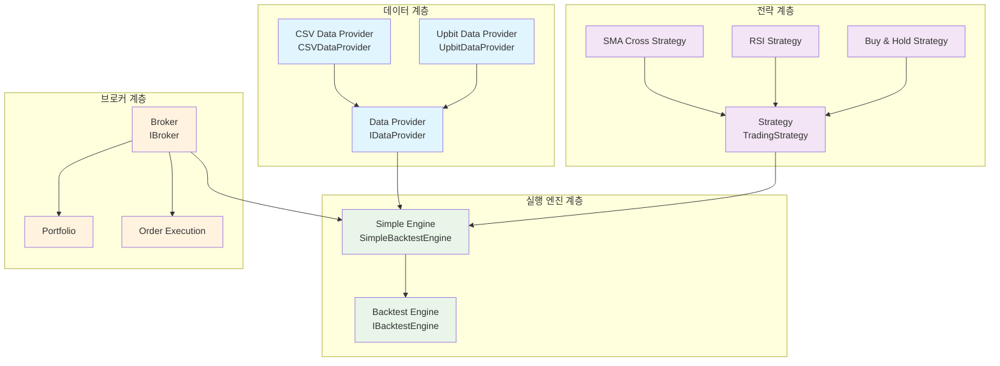
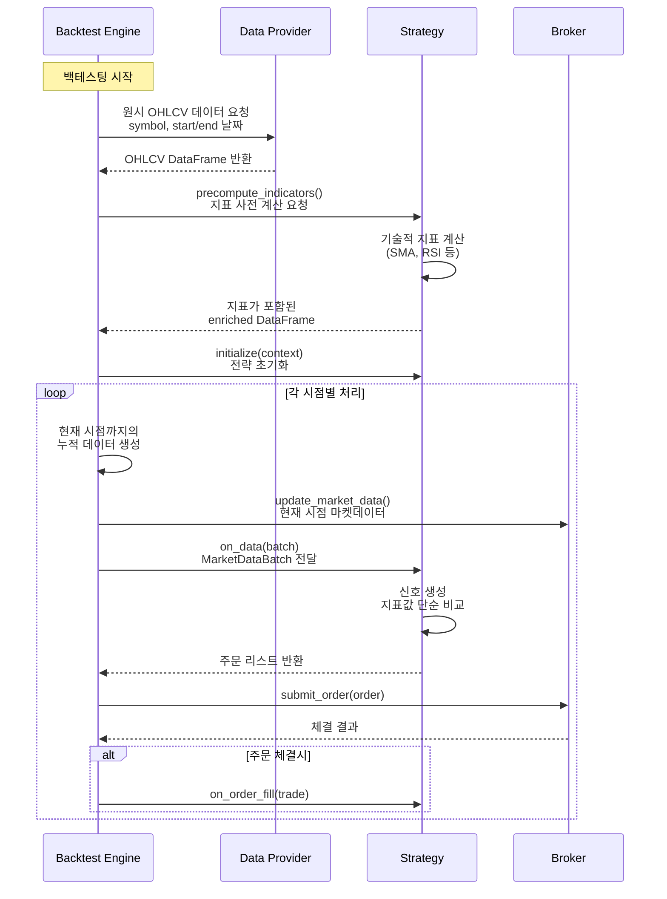
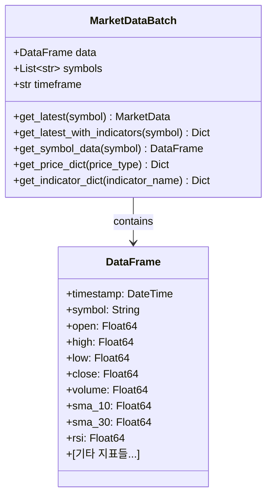

# QuantBT - 퀀트 트레이딩 백테스팅 엔진

[](https://www.python.org/downloads/)
[](https://opensource.org/licenses/MIT)

QuantBT는 **효율적인 지표 사전 계산 기반**의 퀀트 트레이딩 백테스팅 엔진입니다. 클린 아키텍처 원칙을 따라 설계되었으며, 단일 심볼부터 복잡한 멀티심볼, 멀티타임프레임 전략까지 모두 지원합니다.

## 🎯 주요 특징

- **지표 사전 계산**: 백테스팅 시작 전 모든 지표를 미리 계산하여 성능 최적화
- **단순 신호 생성**: 백테스팅 중에는 계산된 지표값과 단순 비교로 빠른 신호 생성
- **룩어헤드 바이어스 방지**: 각 시점에서 과거 데이터만 접근 가능한 누적 데이터 구조
- **실시간 데이터 지원**: 업비트 API를 통한 174개 암호화폐 실시간 데이터 연동 🆕
- **모듈화된 설계**: 각 컴포넌트가 독립적으로 교체 가능
- **비동기 처리**: 대용량 데이터 처리를 위한 효율적인 비동기 아키텍처
- **확장 가능성**: 새로운 전략, 데이터 소스, 브로커 쉽게 추가 가능
- **성능 최적화**: Polars 기반 고속 데이터 처리

## 🏗️ 시스템 아키텍처



## 🔄 기본 데이터 처리 흐름



## 🚀 설치 및 시작하기

### 1. 설치

```bash
# pip를 통한 설치 (향후 지원 예정)
pip install quantbt

# 또는 소스코드에서 직접 설치
git clone https://github.com/your-repo/quantbt
cd quantbt
pip install -e .
```

### 2. 의존성

```bash
pip install polars numpy pydantic click
```

### 3. 기본 사용법

[📊 기본 전략 튜토리얼 Jupyter Notebook 으로 배우기 <-- 클릭](quantbt/examples/simple_strategy_tutorial.ipynb) 

```python
import asyncio
from quantbt import (
    SimpleBacktestEngine,
    CSVDataProvider,
    SimpleBroker,
    SimpleMovingAverageCrossStrategy,
    BacktestConfig
)
from datetime import datetime

async def simple_backtest():
    # 백테스팅 설정
    config = BacktestConfig(
        start_date=datetime(2023, 1, 1),
        end_date=datetime(2023, 12, 31),
        initial_cash=100000.0,
        symbols=["AAPL"],  # 단일 심볼
        timeframe="1D",
        commission_rate=0.001,
        slippage_rate=0.0001
    )
    
    # 컴포넌트 생성
    data_provider = CSVDataProvider("./data")
    broker = SimpleBroker(
        initial_cash=config.initial_cash,
        commission_rate=config.commission_rate,
        slippage_rate=config.slippage_rate
    )
    
    # 이동평균 교차 전략
    strategy = SimpleMovingAverageCrossStrategy(
        short_window=10, 
        long_window=30
    )
    
    engine = SimpleBacktestEngine()
    
    # 백테스팅 실행
    engine.set_strategy(strategy)
    engine.set_data_provider(data_provider)
    engine.set_broker(broker)
    
    result = await engine.run(config)
    
    # 결과 출력
    result.print_summary()
    print(f"총 수익률: {result.total_return_pct:.2f}%")
    print(f"샤프 비율: {result.sharpe_ratio:.2f}")
    print(f"최대 낙폭: {result.max_drawdown_pct:.2f}%")

# 실행
asyncio.run(simple_backtest())
```

## 🎨 내장 전략 예제

### 1. 바이 앤 홀드 전략

```python
from quantbt import BuyAndHoldStrategy

strategy = BuyAndHoldStrategy()
# 초기에 매수 후 계속 보유
```

### 2. 이동평균 교차 전략

```python
from quantbt import SimpleMovingAverageCrossStrategy

strategy = SimpleMovingAverageCrossStrategy(
    short_window=10,  # 단기 이동평균
    long_window=30    # 장기 이동평균
)
# 골든/데드 크로스 신호로 매매
```

### 3. RSI 전략

```python
from quantbt import RSIStrategy

strategy = RSIStrategy(
    rsi_period=14,    # RSI 계산 기간
    oversold=30,      # 과매도 기준
    overbought=70     # 과매수 기준
)
# 과매도/과매수 구간에서 매매
```

### 4. 커스텀 전략 개발

```python
from quantbt import TradingStrategy, Order, OrderSide, OrderType
import polars as pl

class MyCustomStrategy(TradingStrategy):
    """커스텀 전략 예제"""
    
    def __init__(self):
        super().__init__(
            name="MyCustomStrategy",
            position_size_pct=0.9,  # 90% 포지션
            max_positions=1         # 단일 포지션
        )
        self.indicator_columns = ["sma_20", "rsi"]
        
    def _compute_indicators_for_symbol(self, symbol_data: pl.DataFrame) -> pl.DataFrame:
        """지표 사전 계산"""
        data = symbol_data.sort("timestamp")
        
        # SMA와 RSI 계산
        sma_20 = self.calculate_sma(data["close"], 20)
        rsi = self.calculate_rsi(data["close"], 14)
        
        return data.with_columns([
            sma_20.alias("sma_20"),
            rsi.alias("rsi")
        ])
    
    def generate_signals(self, data):
        """신호 생성 - 지표값과 단순 비교"""
        orders = []
        
        for symbol in data.symbols:
            current_price = self.get_current_price(symbol, data)
            sma_value = self.get_indicator_value(symbol, "sma_20", data)
            rsi_value = self.get_indicator_value(symbol, "rsi", data)
            
            if current_price and sma_value and rsi_value:
                current_positions = self.get_current_positions()
                
                # 매수 조건
                if (current_price > sma_value and rsi_value < 30 
                    and symbol not in current_positions):
                    
                    quantity = self.calculate_position_size(
                        symbol, current_price, self.get_portfolio_value()
                    )
                    orders.append(Order(
                        symbol=symbol,
                        side=OrderSide.BUY,
                        quantity=quantity,
                        order_type=OrderType.MARKET
                    ))
                
                # 매도 조건
                elif (symbol in current_positions and 
                      (rsi_value > 70 or current_price < sma_value)):
                    
                    orders.append(Order(
                        symbol=symbol,
                        side=OrderSide.SELL,
                        quantity=current_positions[symbol],
                        order_type=OrderType.MARKET
                    ))
                
        return orders
```

## 💾 업비트 데이터 프로바이더

QuantBT는 **업비트 API**를 통한 실시간 암호화폐 데이터 백테스팅을 지원합니다. 

### 🚀 빠른 시작

```python
from quantbt import UpbitDataProvider, BacktestConfig
from datetime import datetime, timedelta

# 업비트 데이터 프로바이더 생성
upbit_provider = UpbitDataProvider(
    cache_dir="./data/upbit_cache",
    rate_limit_delay=0.1
)

# 주요 암호화폐 백테스팅
config = BacktestConfig(
    symbols=["KRW-BTC", "KRW-ETH", "KRW-XRP"],
    start_date=datetime.now() - timedelta(days=30),
    end_date=datetime.now(),
    timeframe="1h",
    initial_cash=10000000  # 1천만원
)

# 백테스팅 실행
engine = SimpleBacktestEngine()
engine.set_data_provider(upbit_provider)
result = await engine.run(config)
```

### 📚 상세 가이드
업비트 데이터 프로바이더의 자세한 사용법은 **[업비트 프로바이더 가이드](quantbt/docs/upbit_provider_guide.md)**를 참조하세요.

## ⭐ 핵심 컨셉: 지표 사전 계산

### 🔧 작동 원리

1. **데이터 로드**: 원본 OHLCV 데이터를 DataFrame으로 로드
2. **지표 계산**: 필요한 모든 기술적 지표를 사전에 계산
3. **시점별 배치**: 각 시점에서 해당 시점까지의 누적 데이터를 배치로 생성
4. **신호 생성**: 계산된 지표값과 단순 비교로 빠른 신호 생성

### ⚡ 성능 장점

- **빠른 신호 생성**: 백테스팅 중 복잡한 계산 없이 단순 비교만 수행
- **메모리 효율성**: 한 번 계산된 지표를 재사용
- **병렬 처리 최적화**: Polars의 네이티브 연산 활용
- **룩어헤드 바이어스 방지**: 각 시점에서 과거 데이터만 접근 가능

### 🎯 MarketDataBatch 구조



## 📈 성능 분석

백테스팅 결과는 다음과 같은 성능 지표를 제공합니다:

- **수익률 지표**: 총 수익률, 연간 수익률, 월별 수익률
- **리스크 지표**: 변동성, 최대 낙폭, VaR
- **비율 지표**: 샤프 비율, 소르티노 비율, 칼마 비율
- **거래 통계**: 거래 횟수, 승률, 평균 수익/손실

```python
# 결과 분석 예제
result = await engine.run(config)

print(f"총 수익률: {result.total_return_pct:.2f}%")
print(f"연간 수익률: {result.annual_return_pct:.2f}%")
print(f"변동성: {result.volatility_pct:.2f}%")
print(f"샤프 비율: {result.sharpe_ratio:.2f}")
print(f"최대 낙폭: {result.max_drawdown_pct:.2f}%")
print(f"총 거래 수: {result.total_trades}")
print(f"승률: {result.win_rate_pct:.2f}%")
```

## 🔧 고급 기능

### 1. 멀티심볼 포트폴리오 전략 📊
여러 종목을 동시에 관리하는 포트폴리오 전략을 지원합니다.

👉 **[멀티심볼 전략 가이드](quantbt/docs/multi_symbol_guide.md)** - 상세한 사용법과 예제

### 2. 멀티타임프레임 분석 🕐
1분봉 기반으로 5분봉, 1시간봉 등 다양한 시간대를 동시에 분석하여 더 정교한 신호를 생성합니다.

```python
from quantbt import MultiTimeframeSMAStrategy

# 멀티타임프레임 전략 생성
strategy = MultiTimeframeSMAStrategy(
    timeframes=["1m", "5m", "1h"],  # 1분, 5분, 1시간봉 동시 사용
    config={
        "hourly_short_period": 10,   # 1시간봉 단기 SMA
        "hourly_long_period": 20,    # 1시간봉 장기 SMA  
        "signal_short_period": 5,    # 5분봉 단기 SMA
        "signal_long_period": 10     # 5분봉 장기 SMA
    }
)

# 1시간봉 트렌드 + 5분봉 진입신호 조합으로 매매
result = await engine.run(config)
```

👉 **[멀티타임프레임 가이드](quantbt/docs/multi_timeframe_guide.md)** - 상세한 사용법과 예제

### 3. 커스텀 데이터 소스

```python
from quantbt.core.interfaces.data_provider import IDataProvider

class CustomDataProvider(IDataProvider):
    async def load_data(self, symbols, start_date, end_date, timeframe):
        # 커스텀 데이터 로딩 로직
        pass
```

## 📚 문서 및 예제

- **핵심 가이드**
  - [멀티심볼 전략 가이드](quantbt/docs/multi_symbol_guide.md) 📊
  - [멀티타임프레임 가이드](quantbt/docs/multi_timeframe_guide.md) 🕐
  - [업비트 데이터 프로바이더 가이드](quantbt/docs/upbit_provider_guide.md) 🪙
- **참고 문서**
  - [API 문서](quantbt/docs/api.md)
  - [성능 최적화 가이드](quantbt/docs/performance.md)
  - [지표 계산 레퍼런스](quantbt/docs/indicators.md)
- **예제 코드**
  - [📊 기본 전략 튜토리얼](quantbt/examples/simple_strategy_tutorial.ipynb) 
  - [📋 튜토리얼 실행 결과](quantbt/docs/simple_strategy_tutorial_results.md)
  - [전체 예제 코드](quantbt/examples/)

## 🤝 기여하기

1. Fork the repository
2. Create a feature branch (`git checkout -b feature/amazing-feature`)
3. Commit your changes (`git commit -m 'Add some amazing feature'`)
4. Push to the branch (`git push origin feature/amazing-feature`)
5. Open a Pull Request

## 📄 라이센스

이 프로젝트는 MIT 라이센스 하에 배포됩니다. 자세한 내용은 [LICENSE](LICENSE) 파일을 참조하세요.

## 🛣️ 로드맵

- [x] 지표 사전 계산 아키텍처
- [x] 기본 전략 라이브러리 (SMA, RSI, BuyAndHold)
- [x] 룩어헤드 바이어스 방지 시스템
- [x] **업비트 API 데이터 프로바이더** 🆕
- [x] **멀티심볼 포트폴리오 전략** 📊
- [x] **멀티타임프레임 분석 시스템** 🕐
- [ ] 고급 지표 라이브러리 (MACD, Bollinger Bands, Stochastic)
- [ ] 포트폴리오 리밸런싱 전략
- [ ] 백테스팅 병렬처리 지원
- [ ] 웹 기반 대시보드
- [ ] 실시간 데이터 피드 지원
- [ ] 머신러닝 기반 전략 프레임워크
- [ ] 고급 포트폴리오 최적화 도구
- [ ] 리스크 관리 모듈 확장
- [ ] 클라우드 배포 지원

## 💬 지원 및 문의

- 이슈 리포팅: [GitHub Issues](https://github.com/lazydok/quantbt/issues)
- 문의사항: soundlayerd@gmail.com

---

**⚠️ 면책 조항**: 이 소프트웨어는 교육 및 연구 목적으로 제공됩니다. 실제 거래에 사용하기 전에 충분한 검증을 거치시기 바랍니다. 투자 손실에 대한 책임은 사용자에게 있습니다.
