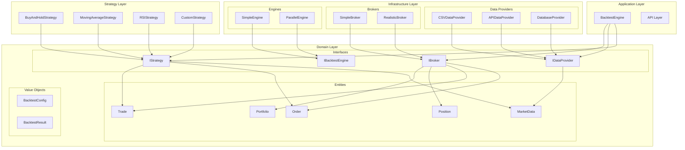
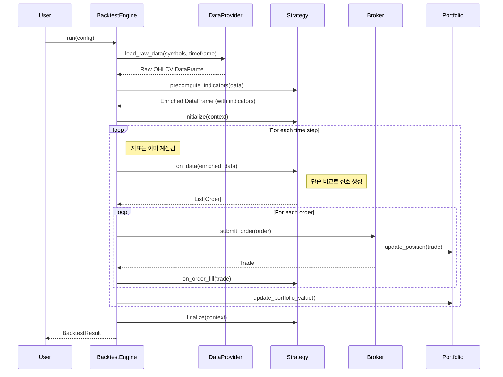

# QuantBT - 퀀트 트레이딩 백테스팅 엔진

[](https://www.python.org/downloads/)
[](https://opensource.org/licenses/MIT)

QuantBT는 **지표 사전 계산 기반**의 퀀트 트레이딩 백테스팅 엔진입니다. 클린 아키텍처 원칙을 따라 설계되었으며, 효율적인 지표 계산과 빠른 신호 생성을 지원합니다.

## 🎯 주요 특징

- **지표 사전 계산**: 백테스팅 시작 전 모든 지표를 미리 계산하여 성능 최적화
- **단순 신호 생성**: 백테스팅 중에는 계산된 지표값과 단순 비교로 빠른 신호 생성
- **모듈화된 설계**: 각 컴포넌트가 독립적으로 교체 가능
- **비동기 처리**: 대용량 데이터 처리를 위한 효율적인 비동기 아키텍처
- **확장 가능성**: 새로운 전략, 데이터 소스, 브로커 쉽게 추가 가능
- **성능 최적화**: Polars 기반 고속 데이터 처리
- **검증된 아키텍처**: 클린 아키텍처와 도메인 주도 설계 원칙 적용

## 🏗️ 시스템 아키텍처



## 🔄 백테스팅 플로우 (지표 사전 계산 방식)



## 🚀 설치 및 시작하기

### 1. 설치

```bash
# pip를 통한 설치 (향후 지원 예정)
pip install quantbt

# 또는 소스코드에서 직접 설치
git clone https://github.com/your-repo/quantbt
cd quantbt
pip install -e .
```

### 2. 의존성

```bash
pip install polars numpy pydantic click
```

## 📊 핵심 컨셉: 지표 사전 계산

### 🔧 작동 원리

1. **데이터 로드**: 원본 OHLCV 데이터를 모두 로드
2. **지표 계산**: 전략별로 필요한 모든 지표를 사전에 계산
3. **백테스팅 실행**: 계산된 지표값과 단순 비교로 신호 생성

### ⚡ 성능 장점

- **빠른 신호 생성**: 백테스팅 중 복잡한 계산 없이 단순 비교만 수행
- **메모리 효율성**: 한 번 계산된 지표를 재사용
- **병렬 처리 최적화**: Polars의 네이티브 연산 활용

## 📋 전략 개발 가이드

### 기본 전략 구조

```python
from quantbt import TradingStrategy
import polars as pl

class MyCustomStrategy(TradingStrategy):
    def __init__(self, param1=10, param2=20):
        super().__init__(
            name="MyCustomStrategy",
            config={"param1": param1, "param2": param2}
        )
        self.param1 = param1
        self.param2 = param2
        self.indicator_columns = ["sma_10", "rsi_14"]  # 추가할 지표 컬럼
    
    def _compute_indicators_for_symbol(self, symbol_data: pl.DataFrame) -> pl.DataFrame:
        """심볼별 지표 사전 계산"""
        # 시간순 정렬 확인
        data = symbol_data.sort("timestamp")
        
        # 필요한 지표들 계산
        sma_10 = self.calculate_sma(data["close"], 10)
        rsi_14 = self.calculate_rsi(data["close"], 14)
        
        # 지표 컬럼 추가하여 반환
        return data.with_columns([
            sma_10.alias("sma_10"),
            rsi_14.alias("rsi_14")
        ])
    
    def generate_signals(self, data):
        """신호 생성 - 지표값과 단순 비교"""
        orders = []
        
        for symbol in data.symbols:
            current_price = self.get_current_price(symbol, data)
            
            # 계산된 지표값 조회
            sma_value = self.get_indicator_value(symbol, "sma_10", data)
            rsi_value = self.get_indicator_value(symbol, "rsi_14", data)
            
            # 단순 비교로 신호 생성
            if current_price > sma_value and rsi_value < 30:
                # 매수 신호
                quantity = self.calculate_position_size(symbol, current_price, 
                                                     self.get_portfolio_value())
                orders.append(Order(
                    symbol=symbol,
                    side=OrderSide.BUY,
                    quantity=quantity,
                    order_type=OrderType.MARKET
                ))
                
        return orders
```

### 사용 가능한 지표 계산 메서드

```python
# StrategyBase에서 제공하는 기본 지표들
def calculate_sma(self, prices: pl.Series, window: int) -> pl.Series:
    """단순 이동평균"""

def calculate_ema(self, prices: pl.Series, span: int) -> pl.Series:
    """지수 이동평균"""

def calculate_rsi(self, prices: pl.Series, period: int = 14) -> pl.Series:
    """RSI (상대강도지수)"""
```

## 📋 간단한 사용 예제

```python
import asyncio
from quantbt import (
    SimpleBacktestEngine,
    CSVDataProvider,
    SimpleBroker,
    SimpleMovingAverageCrossStrategy,
    BacktestConfig
)

async def simple_backtest():
    # 백테스팅 설정
    config = BacktestConfig(
        start_date=datetime(2023, 1, 1),
        end_date=datetime(2023, 12, 31),
        initial_cash=100000.0,
        symbols=["AAPL", "MSFT", "GOOGL"],
        timeframe="1D",
        commission_rate=0.001,
        slippage_rate=0.0001
    )
    
    # 컴포넌트 생성
    data_provider = CSVDataProvider("./data")
    broker = SimpleBroker(
        initial_cash=config.initial_cash,
        commission_rate=config.commission_rate,
        slippage_rate=config.slippage_rate
    )
    
    # 이동평균 교차 전략 (지표 자동 계산)
    strategy = SimpleMovingAverageCrossStrategy(short_window=10, long_window=30)
    engine = SimpleBacktestEngine()
    
    # 백테스팅 실행
    engine.set_strategy(strategy)
    engine.set_data_provider(data_provider)
    engine.set_broker(broker)
    
    result = await engine.run(config)
    
    # 결과 출력
    result.print_summary()
    print(f"총 수익률: {result.total_return_pct:.2f}%")
    print(f"샤프 비율: {result.sharpe_ratio:.2f}")
    print(f"최대 낙폭: {result.max_drawdown_pct:.2f}%")

# 실행
asyncio.run(simple_backtest())
```

## 🎨 내장 전략 예제

### 1. 바이 앤 홀드 전략

```python
from quantbt import BuyAndHoldStrategy

strategy = BuyAndHoldStrategy()
# 지표 계산 없음 - 단순 매수 후 보유
```

### 2. 이동평균 교차 전략

```python
from quantbt import SimpleMovingAverageCrossStrategy

strategy = SimpleMovingAverageCrossStrategy(
    short_window=10,  # 단기 이동평균
    long_window=30    # 장기 이동평균
)
# 백테스팅 시작 전 SMA_10, SMA_30 자동 계산
# 골든/데드 크로스 신호로 매매
```

### 3. RSI 전략

```python
from quantbt import RSIStrategy

strategy = RSIStrategy(
    rsi_period=14,    # RSI 계산 기간
    oversold=30,      # 과매도 기준
    overbought=70     # 과매수 기준
)
# RSI 지표 사전 계산 후 과매도/과매수 구간에서 매매
```

### 4. 커스텀 복합 전략

```python
from quantbt import TradingStrategy, Order, OrderSide, OrderType
import polars as pl

class MACDRSIStrategy(TradingStrategy):
    """MACD + RSI 복합 전략"""
    
    def __init__(self):
        super().__init__("MACDRSIStrategy")
        self.indicator_columns = ["macd", "macd_signal", "rsi"]
        
    def _compute_indicators_for_symbol(self, symbol_data: pl.DataFrame) -> pl.DataFrame:
        data = symbol_data.sort("timestamp")
        
        # MACD 계산
        ema_12 = self.calculate_ema(data["close"], 12)
        ema_26 = self.calculate_ema(data["close"], 26)
        macd = ema_12 - ema_26
        macd_signal = self.calculate_ema(macd, 9)
        
        # RSI 계산
        rsi = self.calculate_rsi(data["close"], 14)
        
        return data.with_columns([
            macd.alias("macd"),
            macd_signal.alias("macd_signal"),
            rsi.alias("rsi")
        ])
    
    def generate_signals(self, data):
        orders = []
        
        for symbol in data.symbols:
            current_price = self.get_current_price(symbol, data)
            
            # 지표값 조회
            macd = self.get_indicator_value(symbol, "macd", data)
            macd_signal = self.get_indicator_value(symbol, "macd_signal", data)
            rsi = self.get_indicator_value(symbol, "rsi", data)
            
            if all(v is not None for v in [macd, macd_signal, rsi]):
                # 매수 조건: MACD 상승 돌파 + RSI 과매도
                if macd > macd_signal and rsi < 30:
                    quantity = self.calculate_position_size(
                        symbol, current_price, self.get_portfolio_value()
                    )
                    orders.append(Order(
                        symbol=symbol,
                        side=OrderSide.BUY,
                        quantity=quantity,
                        order_type=OrderType.MARKET
                    ))
                
                # 매도 조건: RSI 과매수
                elif rsi > 70:
                    positions = self.get_current_positions()
                    if symbol in positions and positions[symbol] > 0:
                        orders.append(Order(
                            symbol=symbol,
                            side=OrderSide.SELL,
                            quantity=positions[symbol],
                            order_type=OrderType.MARKET
                        ))
        
        return orders
```

## 📈 성능 분석

백테스팅 결과는 다음과 같은 성능 지표를 제공합니다:

- **수익률 지표**: 총 수익률, 연간 수익률, 월별 수익률
- **리스크 지표**: 변동성, 최대 낙폭, VaR
- **비율 지표**: 샤프 비율, 소르티노 비율, 칼마 비율
- **거래 통계**: 거래 횟수, 승률, 평균 수익/손실

```python
# 결과 분석 예제
result = await engine.run(config)

print(f"총 수익률: {result.total_return_pct:.2f}%")
print(f"연간 수익률: {result.annual_return_pct:.2f}%")
print(f"변동성: {result.volatility_pct:.2f}%")
print(f"샤프 비율: {result.sharpe_ratio:.2f}")
print(f"최대 낙폭: {result.max_drawdown_pct:.2f}%")
print(f"총 거래 수: {result.total_trades}")
print(f"승률: {result.win_rate_pct:.2f}%")
```

## 🔧 고급 기능

### 1. 멀티 심볼 전략

```python
config = BacktestConfig(
    symbols=["AAPL", "MSFT", "GOOGL", "AMZN", "TSLA"],
    # ... 기타 설정
)
# 각 심볼별로 독립적으로 지표 계산
```

### 2. 다양한 시간프레임

```python
# 지원되는 시간프레임
timeframes = ["1m", "5m", "15m", "1h", "4h", "1D", "1W", "1M"]
```

### 3. 커스텀 데이터 소스

```python
from quantbt.core.interfaces.data_provider import IDataProvider

class CustomDataProvider(IDataProvider):
    async def load_data(self, symbols, start_date, end_date, timeframe):
        # 커스텀 데이터 로딩 로직
        pass
```

### 4. 지표 캐싱 및 최적화

```python
class OptimizedStrategy(TradingStrategy):
    def _compute_indicators_for_symbol(self, symbol_data: pl.DataFrame) -> pl.DataFrame:
        # 대용량 데이터를 위한 배치 처리
        data = symbol_data.sort("timestamp")
        
        # 여러 지표를 한 번에 계산하여 성능 최적화
        indicators = data.select([
            pl.col("close").rolling_mean(10).alias("sma_10"),
            pl.col("close").rolling_mean(30).alias("sma_30"),
            pl.col("close").ewm_mean(span=12).alias("ema_12"),
            # ... 추가 지표들
        ])
        
        return pl.concat([data, indicators], how="horizontal")
```

## 🧪 테스팅

```bash
# 전체 테스트 실행
pytest

# 지표 계산 테스트
pytest tests/test_indicator_precompute.py

# 전략 테스트
pytest tests/test_strategies.py

# 커버리지 포함 테스트
pytest --cov=quantbt
```

## 📚 문서 및 예제

- [전체 예제 코드](./examples/)
- [API 문서](./docs/api.md)
- [전략 개발 가이드](./docs/strategy_guide.md)
- [성능 최적화 가이드](./docs/performance.md)
- [지표 계산 레퍼런스](./docs/indicators.md)

## 🤝 기여하기

1. Fork the repository
2. Create a feature branch (`git checkout -b feature/amazing-feature`)
3. Commit your changes (`git commit -m 'Add some amazing feature'`)
4. Push to the branch (`git push origin feature/amazing-feature`)
5. Open a Pull Request

## 📄 라이센스

이 프로젝트는 MIT 라이센스 하에 배포됩니다. 자세한 내용은 [LICENSE](LICENSE) 파일을 참조하세요.

## 🛣️ 로드맵

- [x] 지표 사전 계산 아키텍처
- [x] 기본 전략 라이브러리 (SMA, RSI, BuyAndHold)
- [ ] 고급 지표 라이브러리 (MACD, Bollinger Bands, Stochastic)
- [ ] 웹 기반 대시보드
- [ ] 실시간 데이터 피드 지원
- [ ] 머신러닝 기반 전략 프레임워크
- [ ] 포트폴리오 최적화 도구
- [ ] 리스크 관리 모듈 확장
- [ ] 클라우드 배포 지원

## 💬 지원 및 문의

- 이슈 리포팅: [GitHub Issues](https://github.com/your-repo/quantbt/issues)
- 문의사항: your-email@example.com
- 커뮤니티: [Discord](https://discord.gg/your-discord)

---

**⚠️ 면책 조항**: 이 소프트웨어는 교육 및 연구 목적으로 제공됩니다. 실제 거래에 사용하기 전에 충분한 검증을 거치시기 바랍니다. 투자 손실에 대한 책임은 사용자에게 있습니다.
