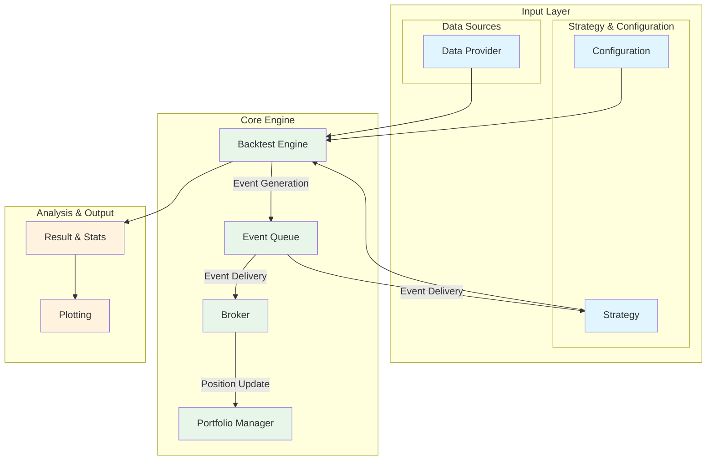

# QuantBT: Python-based Quantitative Trading Backtesting Framework

[](https://www.python.org/downloads/)
[](https://opensource.org/licenses/MIT)

**QuantBT** is an **event-driven backtesting framework** designed to quickly and efficiently validate trading ideas, optimize strategies, and apply them to real markets.

From simple strategies to complex portfolio strategies spanning multiple assets and timeframes, QuantBT accelerates your quantitative trading research and development with clear code and powerful performance.

## 🚀 Key Features

- **🚀 High-Performance Backtesting Engine**: Leverages Rust-based `Polars` dataframes to process large-scale time series data at extremely fast speeds.
- **✨ Flexible Strategy Implementation**: Easily implement various types of strategies including single-symbol, multi-symbol, cross-symbol, and multi-timeframe strategies.
- **🛠️ Powerful Optimization Tools**: Execute cutting-edge parameter optimization techniques from grid search to Bayesian optimization quickly through parallel processing with `Ray`.
- **📈 Intuitive Result Analysis**: Analyze strategy performance from multiple angles and gain deep insights through reports containing backtesting results and **diverse visualization charts**.
- **🔌 Extensible Architecture**: Designed to allow users to directly define and extend all elements including data sources, risk management, and portfolio construction.
- **💡 Look-ahead Bias Prevention**: Designed to access only past and present data at each time point, fundamentally preventing mistakes of referencing future data.

## 🏗️ System Architecture



## 📦 Installation

```bash
# Clone repository
git clone https://github.com/lazydok/quantbt.git
cd quantbt

# Install dependencies
pip install -r requirements.txt

# Install in development mode
pip install -e .
```

or

```bash
pip install git+https://github.com/lazydok/quantbt.git
```

## ⚡ Quick Start in 5 Minutes: Simple Strategy Backtesting

Here's an example of backtesting a simple strategy using the crossover of two moving averages.

```python
from datetime import datetime
from quantbt import (
    BacktestEngine,
    BacktestConfig,
    UpbitDataProvider,
    SimpleBroker,
    SimpleSMAStrategy,
)

# 1. Set up data provider
data_provider = UpbitDataProvider()

# 2. Configure backtesting
config = BacktestConfig(
    symbols=["KRW-BTC"],
    start_date=datetime(2023, 1, 1),
    end_date=datetime(2023, 12, 31),
    timeframe="1d",
    initial_cash=10000,
    commission_rate=0.001,
    slippage_rate=0.0,
    save_portfolio_history=True,
)

# 3. Select strategy
strategy = SimpleSMAStrategy(buy_sma=10, sell_sma=30)

# 4. Set up broker
broker = SimpleBroker(
    initial_cash=config.initial_cash,
    commission_rate=config.commission_rate,
)

# 5. Set up backtesting engine and run
engine = BacktestEngine()
engine.set_strategy(strategy)
engine.set_data_provider(data_provider)
engine.set_broker(broker)

result = engine.run(config)

# 6. Check results
result.print_summary()
```

## 📊 Rich Visualization

QuantBT provides various visualization charts to effectively analyze backtesting results. Intuitively understand complex data such as equity curves, drawdowns, and trade history to gain deep insights into your strategies.

| Equity Curve & Key Metrics | Return Distribution |
| :---: | :---: |
|  |  |

| Monthly Return Heatmap | Strategy Performance Metrics |
| :---: | :---: |
|  |  |

## 📚 Tutorials and Guides

Learn QuantBT's powerful and diverse features through examples.

| Tutorial                               | Description                                                                   | Guide Document                                                                      | Example Notebook                                                                            |
| -------------------------------------- | ----------------------------------------------------------------------------- | -------------------------------------------------------------------------------- | -------------------------------------------------------------------------------------- |
| **1. Basic Strategy Backtesting**     | Learn the basic backtesting process for a single symbol.                      | [📄 Guide](./quantbt/docs/01_simple_strategy_guide.md)                     | [💻 Code](./quantbt/examples/01_simple_strategy.ipynb)                            |
| **2. Multi-Symbol Strategy**          | Test portfolio strategies composed of multiple symbols.                       | [📄 Guide](./quantbt/docs/02_multi_symbol_strategy_guide.md)                 | [💻 Code](./quantbt/examples/02_multi_symbol_strategy.ipynb)                        |
| **3. Cross-Symbol Strategy**          | Implement advanced strategies that trade one symbol based on another's indicators. | [📄 Guide](./quantbt/docs/03_cross_symbol_indicator_strategy_guide.md)     | [💻 Code](./quantbt/examples/03_cross_symbol_indicator_strategy.ipynb)              |
| **4. Multi-Timeframe Strategy**       | Analyze more precise trading timing using both hourly and minute bars.       | [📄 Guide](./quantbt/docs/04_multi_timeframe_strategy_guide.md)            | [💻 Code](./quantbt/examples/04_multi_timeframe_strategy.ipynb)                     |
| **5. Parallel Parameter Search**      | Quickly find optimal parameters by performing grid search in parallel.       | [📄 Guide](./quantbt/docs/05_parallel_search_guide.md)                     | [💻 Code](./quantbt/examples/05_parallel_search.ipynb)                            |
| **6. Bayesian Optimization**          | Perform intelligent optimization to find better parameters with fewer attempts. | [📄 Guide](./quantbt/docs/06_bayesian_optimization_guide.md)                 | [💻 Code](./quantbt/examples/06_bayesian_optimization.ipynb)                        |

## 🛣️ Roadmap

- [x] High-performance event-driven backtesting engine
- [x] Basic strategy library (SMA, RSI, Buy & Hold)
- [x] Look-ahead bias prevention system
- [x] Multi-symbol portfolio strategy support
- [x] Multi-timeframe analysis system (resampling)
- [x] Parameter optimization parallel processing (Ray integration)
- [x] Bayesian parameter optimization
- [ ] Real-time data feed integration (Live Trading)
- [ ] Machine Learning/Deep Learning strategy framework integration
- [ ] Cloud-based large-scale backtesting support
- [ ] Web-based analysis dashboard

## 🤝 Contributing

QuantBT is an open-source project. We welcome your contributions at any time! Bug reports, feature suggestions, code contributions - any form of participation is appreciated.

1.  Fork the repository.
2.  Create a new feature branch (`git checkout -b feature/amazing-feature`).
3.  Commit your changes (`git commit -m 'Add some amazing feature'`).
4.  Push to the branch (`git push origin feature/amazing-feature`).
5.  Open a Pull Request.

## 📄 License

This project is distributed under the MIT License. See the [LICENSE](LICENSE) file for details.

---

**⚠️ Disclaimer**: This software is provided for educational and research purposes only. All responsibility for actual investment decisions lies with the user.
