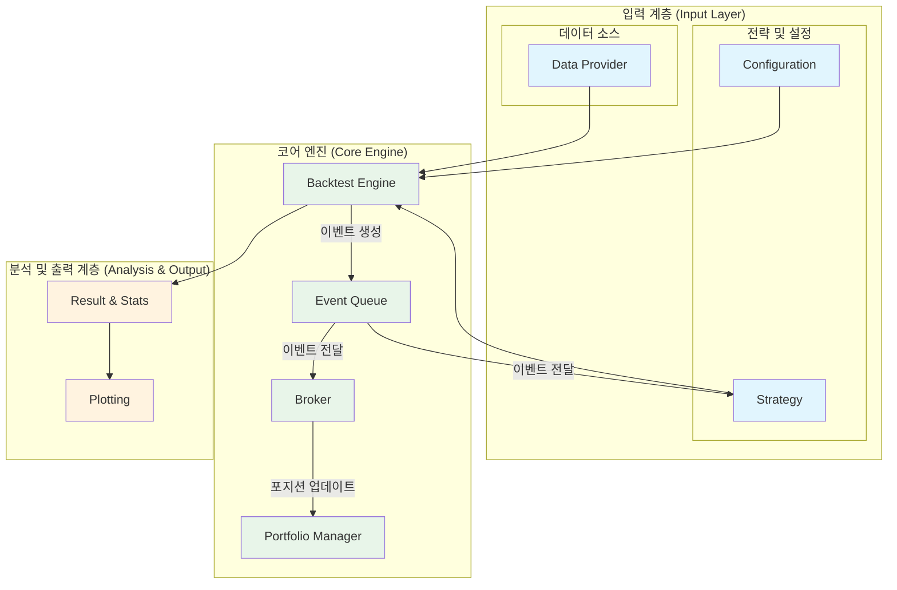
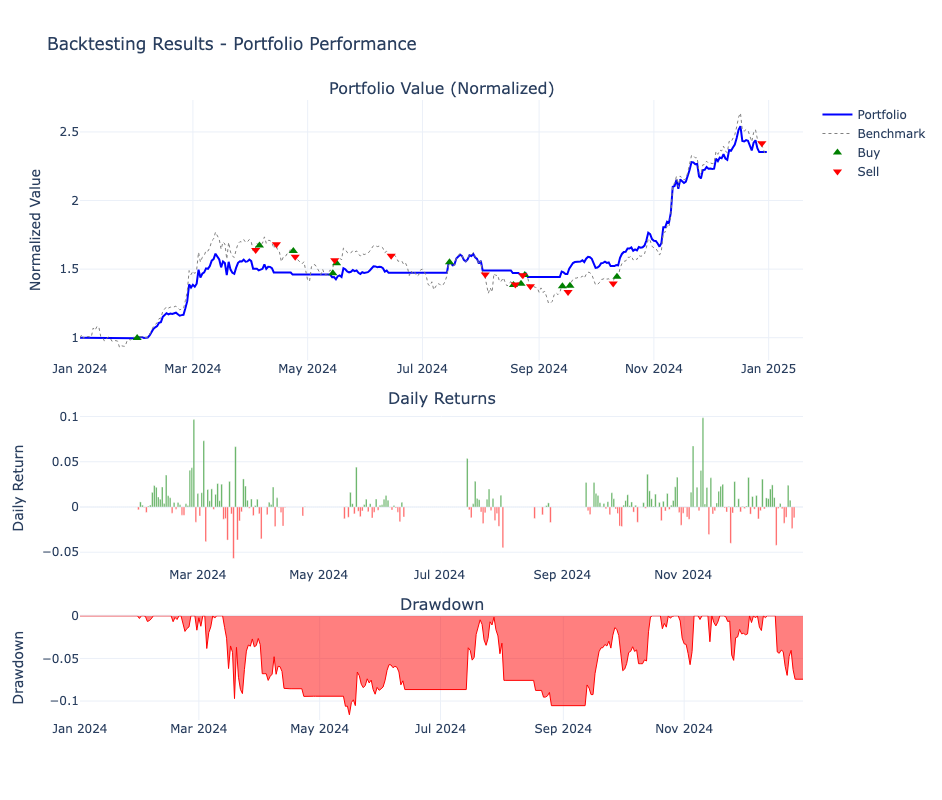
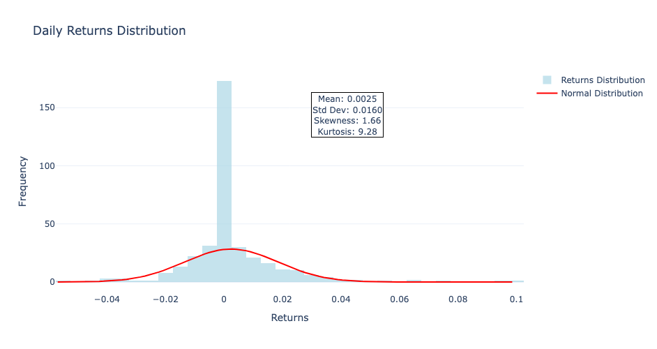
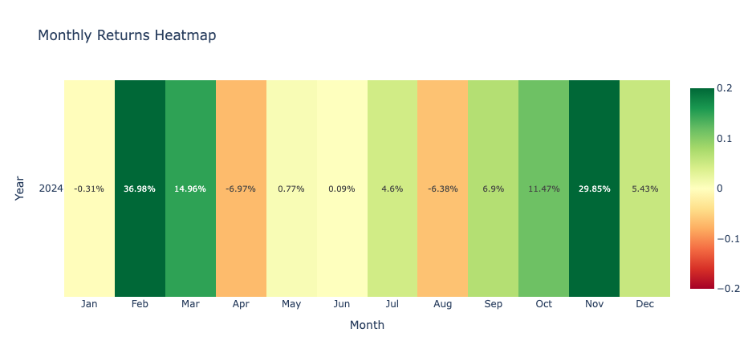
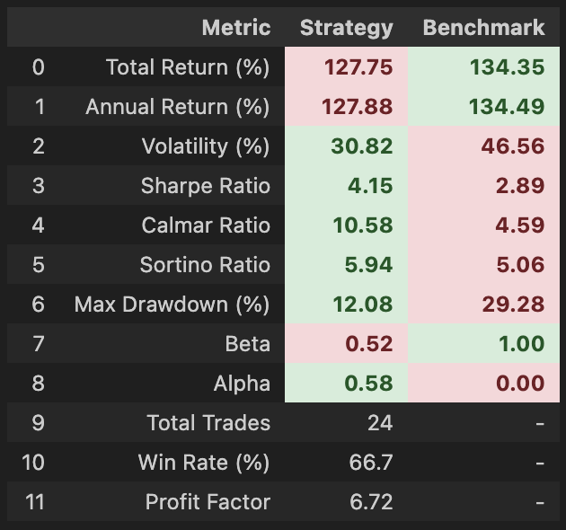

# QuantBT: 파이썬 기반 퀀트 트레이딩 백테스팅 프레임워크

[](https://www.python.org/downloads/)
[](https://opensource.org/licenses/MIT)

**QuantBT**는 트레이딩 아이디어를 빠르고 효율적으로 검증하고, 전략을 최적화하며, 실제 시장에 적용할 수 있도록 설계된 **이벤트 기반(Event-Driven) 백테스팅 프레임워크**입니다.

단순한 전략부터 여러 자산과 시간대를 아우르는 복잡한 포트폴리오 전략까지, QuantBT는 명료한 코드와 강력한 성능으로 여러분의 퀀트 트레이딩 연구 개발을 가속화합니다.

## 🚀 주요 특징

- **🚀 고성능 백테스팅 엔진**: Rust 기반의 `Polars` 데이터프레임을 활용하여 대규모 시계열 데이터를 매우 빠른 속도로 처리합니다.
- **✨ 유연한 전략 구현**: 단일 종목, 멀티 심볼, 크로스 심볼, 멀티 타임프레임 등 다양한 형태의 전략을 손쉽게 구현할 수 있습니다.
- **🛠️ 강력한 최적화 도구**: 그리드 서치부터 베이지안 최적화까지, 최첨단 파라미터 최적화 기법을 `Ray`를 통한 병렬 처리로 빠르게 실행합니다.
- **📈 직관적인 결과 분석**: 백테스팅 결과를 담은 리포트와 **다채로운 시각화 차트**를 통해 전략의 성과를 다각도로 분석하고 깊이 있는 인사이트를 얻을 수 있습니다.
- **🔌 확장 가능한 아키텍처**: 데이터 소스, 리스크 관리, 포트폴리오 구성 등 모든 요소를 사용자가 직접 정의하고 확장할 수 있도록 설계되었습니다.
- **💡 룩어헤드 편향 방지**: 각 시점에서는 과거와 현재 데이터만 접근할 수 있도록 설계되어 미래 데이터를 참조하는 실수를 원천적으로 방지합니다.

## 🏗️ 시스템 아키텍처



## 📦 설치

```bash
# 저장소 클론
git clone https://github.com/lazydok/quantbt.git
cd quantbt

# 의존성 설치
pip install -r requirements.txt

# 가상 편집 모드로 설치
pip install -e .
```

## ⚡ 5분 만에 시작하기: 간단한 전략 백테스팅

이동평균선 두 개의 교차를 이용하는 간단한 전략을 백테스팅하는 예제입니다.

```python
from datetime import datetime
from quantbt import (
    BacktestEngine,
    BacktestConfig,
    UpbitDataProvider,
    SimpleBroker,
    SimpleSMAStrategy,
)

# 1. 데이터 프로바이더 설정
data_provider = UpbitDataProvider()

# 2. 백테스팅 설정
config = BacktestConfig(
    symbols=["KRW-BTC"],
    start_date=datetime(2023, 1, 1),
    end_date=datetime(2023, 12, 31),
    timeframe="1d",
    initial_cash=10000,
    commission_rate=0.001,
    slippage_rate=0.0,
    save_portfolio_history=True,
)

# 3. 전략 선택
strategy = SimpleSMAStrategy(buy_sma=10, sell_sma=30)

# 4. 브로커 설정
broker = SimpleBroker(
    initial_cash=config.initial_cash,
    commission_rate=config.commission_rate,
)

# 5. 백테스팅 엔진 설정 및 실행
engine = BacktestEngine()
engine.set_strategy(strategy)
engine.set_data_provider(data_provider)
engine.set_broker(broker)

result = engine.run(config)

# 6. 결과 확인
result.print_summary()
```

## 📊 풍부한 시각화

QuantBT는 백테스팅 결과를 효과적으로 분석할 수 있도록 다양한 시각화 차트를 제공합니다. 자산 곡선, 드로우다운, 거래 내역 등 복잡한 데이터를 직관적으로 파악하고 전략에 대한 깊이 있는 인사이트를 얻으세요.

| 자산 곡선 및 주요 지표 | 수익률 분포도 |
| :---: | :---: |
|  |  |

| 월별 수익률 히트맵 | 전략 성과 지표 |
| :---: | :---: |
|  |  |

## 📚 튜토리얼 및 가이드

QuantBT의 강력하고 다양한 기능들을 예제와 함께 배워보세요.

| 튜토리얼                               | 설명                                                                   | 가이드 문서                                                                      | 예제 노트북                                                                            |
| -------------------------------------- | ---------------------------------------------------------------------- | -------------------------------------------------------------------------------- | -------------------------------------------------------------------------------------- |
| **1. 기본 전략 백테스팅**          | 단일 종목에 대한 기본적인 백테스팅 과정을 알아봅니다.                  | [📄 가이드 보기](./quantbt/docs/01_simple_strategy_guide.md)                     | [💻 코드 실행](./quantbt/examples/01_simple_strategy.ipynb)                            |
| **2. 멀티 심볼 전략**              | 여러 종목으로 구성된 포트폴리오 전략을 테스트합니다.                   | [📄 가이드 보기](./quantbt/docs/02_multi_symbol_strategy_guide.md)                 | [💻 코드 실행](./quantbt/examples/02_multi_symbol_strategy.ipynb)                        |
| **3. 크로스 심볼 전략**            | 특정 종목의 지표로 다른 종목을 거래하는 고급 전략을 구현합니다.          | [📄 가이드 보기](./quantbt/docs/03_cross_symbol_indicator_strategy_guide.md)     | [💻 코드 실행](./quantbt/examples/03_cross_symbol_indicator_strategy.ipynb)              |
| **4. 멀티 타임프레임 전략**        | 시간봉과 분봉을 함께 사용하여 더 정교한 매매 타이밍을 분석합니다.        | [📄 가이드 보기](./quantbt/docs/04_multi_timeframe_strategy_guide.md)            | [💻 코드 실행](./quantbt/examples/04_multi_timeframe_strategy.ipynb)                     |
| **5. 파라미터 병렬 탐색**          | 그리드 서치를 병렬로 수행하여 최적의 파라미터를 빠르게 찾습니다.       | [📄 가이드 보기](./quantbt/docs/05_parallel_search_guide.md)                     | [💻 코드 실행](./quantbt/examples/05_parallel_search.ipynb)                            |
| **6. 베이지안 최적화**             | 더 적은 시도로 더 나은 파라미터를 찾는 지능적인 최적화를 수행합니다.     | [📄 가이드 보기](./quantbt/docs/06_bayesian_optimization_guide.md)                 | [💻 코드 실행](./quantbt/examples/06_bayesian_optimization.ipynb)                        |

## 🛣️ 로드맵

- [x] 고성능 이벤트 기반 백테스팅 엔진
- [x] 기본 전략 라이브러리 (SMA, RSI, Buy & Hold)
- [x] 룩어헤드 편향 방지 시스템
- [x] 멀티 심볼 포트폴리오 전략 지원
- [x] 멀티 타임프레임 분석 시스템 (리샘플링)
- [x] 파라미터 최적화 병렬 처리 (Ray 연동)
- [x] 베이지안 파라미터 최적화
- [ ] 실시간 데이터 피드 연동 (Live Trading)
- [ ] 머신러닝/딥러닝 전략 프레임워크 통합
- [ ] 클라우드 기반 대규모 백테스팅 지원
- [ ] 웹 기반 분석 대시보드

## 🤝 기여하기

QuantBT는 오픈소스 프로젝트입니다. 여러분의 기여를 언제나 환영합니다! 버그 리포트, 기능 제안, 코드 기여 등 어떤 형태의 참여든 좋습니다.

1.  저장소를 Fork 하세요.
2.  새로운 기능 브랜치를 만드세요 (`git checkout -b feature/amazing-feature`).
3.  변경사항을 커밋하세요 (`git commit -m 'Add some amazing feature'`).
4.  브랜치에 푸시하세요 (`git push origin feature/amazing-feature`).
5.  Pull Request를 열어주세요.

## 📄 라이센스

이 프로젝트는 MIT 라이센스 하에 배포됩니다. 자세한 내용은 [LICENSE](LICENSE) 파일을 참조하세요.

---

**⚠️ 면책 조항**: 이 소프트웨어는 교육 및 연구 목적으로만 제공됩니다. 실제 투자에 따른 모든 책임은 사용자 본인에게 있습니다.
