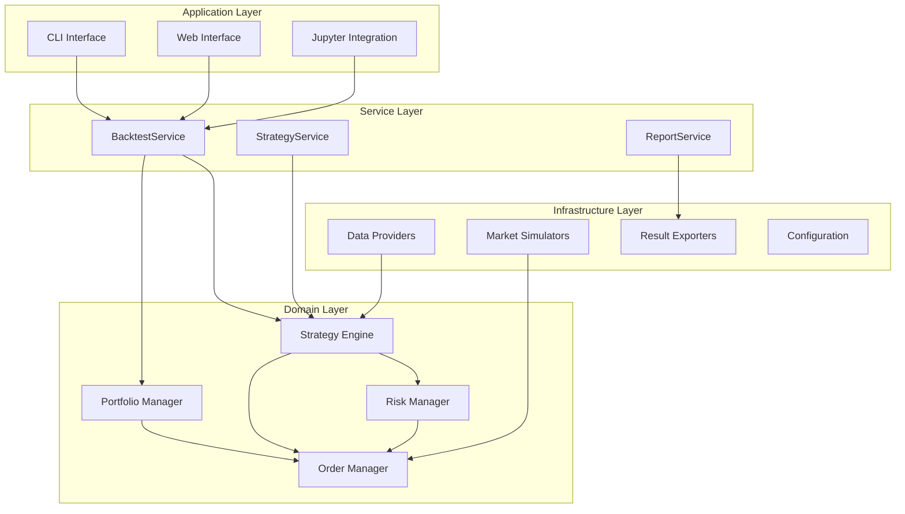

# 개선된 백테스팅 엔진 설계안

## 프로젝트 개요

**프로젝트명**: `quantbt` (Quantitative Backtesting Engine)

**목표**: 모듈화되고 확장 가능한 고성능 백테스팅 엔진 개발

## 핵심 설계 원칙

### 1. **느슨한 결합 (Loose Coupling)**
- 인터페이스 기반 설계
- 의존성 주입 패턴 적용
- 플러그인 아키텍처

### 2. **높은 응집도 (High Cohesion)**
- 단일 책임 원칙
- 명확한 도메인 분리
- 계층화된 아키텍처

### 3. **확장성 (Extensibility)**
- 새로운 전략, 지표, 데이터 소스 쉽게 추가
- 커스텀 주문 타입 지원
- 다양한 출력 형식 지원

### 4. **성능 (Performance)**
- 비동기 처리 지원
- 메모리 효율적 데이터 구조
- 병렬 처리 최적화

## 아키텍처 설계

### 전체 아키텍처



### 패키지 구조

```
quantbt/
├── __init__.py
├── core/                    # 핵심 도메인 로직
│   ├── __init__.py
│   ├── interfaces/          # 인터페이스 정의
│   │   ├── __init__.py
│   │   ├── strategy.py
│   │   ├── data_provider.py
│   │   ├── broker.py
│   │   └── portfolio.py
│   ├── entities/           # 도메인 엔티티
│   │   ├── __init__.py
│   │   ├── market_data.py
│   │   ├── order.py
│   │   ├── position.py
│   │   ├── account.py
│   │   └── trade.py
│   ├── services/           # 도메인 서비스
│   │   ├── __init__.py
│   │   ├── backtest_engine.py
│   │   ├── portfolio_manager.py
│   │   ├── risk_manager.py
│   │   └── order_manager.py
│   └── value_objects/      # 값 객체
│       ├── __init__.py
│       ├── market_info.py
│       ├── timeframe.py
│       └── money.py
├── infrastructure/         # 인프라스트럭처
│   ├── __init__.py
│   ├── data/              # 데이터 제공자
│   │   ├── __init__.py
│   │   ├── csv_provider.py
│   │   ├── database_provider.py
│   │   └── api_provider.py
│   ├── brokers/           # 브로커 시뮬레이터
│   │   ├── __init__.py
│   │   ├── simple_broker.py
│   │   └── realistic_broker.py
│   ├── exporters/         # 결과 내보내기
│   │   ├── __init__.py
│   │   ├── csv_exporter.py
│   │   ├── html_exporter.py
│   │   └── json_exporter.py
│   └── config/            # 설정 관리
│       ├── __init__.py
│       └── settings.py
├── strategies/            # 전략 라이브러리
│   ├── __init__.py
│   ├── base/
│   │   ├── __init__.py
│   │   └── strategy_base.py
│   ├── technical/
│   │   ├── __init__.py
│   │   ├── sma_crossover.py
│   │   └── rsi_strategy.py
│   └── examples/
│       ├── __init__.py
│       └── buy_and_hold.py
├── indicators/            # 기술적 지표
│   ├── __init__.py
│   ├── trend/
│   ├── momentum/
│   ├── volatility/
│   └── volume/
├── utils/                 # 유틸리티
│   ├── __init__.py
│   ├── logging.py
│   ├── validation.py
│   └── helpers.py
├── analysis/              # 성과 분석
│   ├── __init__.py
│   ├── metrics/           # 성과 지표
│   │   ├── __init__.py
│   │   ├── returns.py     # 수익률 지표
│   │   ├── risk.py        # 리스크 지표
│   │   ├── risk_adjusted.py  # 위험조정수익률
│   │   └── trading.py     # 거래 통계
│   ├── visualizations.py  # 시각화
│   ├── performance_report.py  # 종합 리포트
│   └── benchmarks.py      # 벤치마크 비교
└── tests/                 # 테스트
    ├── __init__.py
    ├── unit/
    ├── integration/
    └── fixtures/
```

## 핵심 컴포넌트 설계

### 1. 인터페이스 정의

```python
# core/interfaces/strategy.py
from abc import ABC, abstractmethod
from typing import Protocol, List, Dict, Any
from datetime import datetime

class IStrategy(Protocol):
    """전략 인터페이스"""
    
    def initialize(self, context: 'BacktestContext') -> None:
        """전략 초기화"""
        ...
    
    def on_data(self, data: 'MarketData') -> List['Order']:
        """데이터 수신 시 호출"""
        ...
    
    def on_order_fill(self, trade: 'Trade') -> None:
        """주문 체결 시 호출"""
        ...
    
    def finalize(self, context: 'BacktestContext') -> None:
        """백테스팅 종료 시 호출"""
        ...

# core/interfaces/data_provider.py
class IDataProvider(Protocol):
    """데이터 제공자 인터페이스"""
    
    def get_data(self, symbols: List[str], start: datetime, end: datetime) -> 'MarketData':
        """시장 데이터 조회"""
        ...
    
    def get_symbols(self) -> List[str]:
        """사용 가능한 심볼 목록"""
        ...

# core/interfaces/broker.py
class IBroker(Protocol):
    """브로커 인터페이스"""
    
    def submit_order(self, order: 'Order') -> str:
        """주문 제출"""
        ...
    
    def cancel_order(self, order_id: str) -> bool:
        """주문 취소"""
        ...
    
    def get_account(self) -> 'Account':
        """계좌 정보 조회"""
        ...
```

### 2. 엔티티 설계

```python
# core/entities/market_data.py
from dataclasses import dataclass
from datetime import datetime
from typing import Dict, Optional
import polars as pl

@dataclass(frozen=True)
class MarketData:
    """시장 데이터"""
    timestamp: datetime
    symbol: str
    open: float
    high: float
    low: float
    close: float
    volume: float
    metadata: Optional[Dict] = None

# core/entities/order.py
from enum import Enum
from dataclasses import dataclass
from typing import Optional

class OrderType(Enum):
    MARKET = "market"
    LIMIT = "limit"
    STOP = "stop"
    STOP_LIMIT = "stop_limit"

class OrderSide(Enum):
    BUY = 1
    SELL = -1

@dataclass
class Order:
    """주문"""
    symbol: str
    side: OrderSide
    quantity: float
    order_type: OrderType
    price: Optional[float] = None
    stop_price: Optional[float] = None
    time_in_force: str = "GTC"
    metadata: Optional[Dict] = None

# core/entities/position.py
@dataclass
class Position:
    """포지션"""
    symbol: str
    quantity: float
    avg_price: float
    market_value: float
    unrealized_pnl: float
    realized_pnl: float
```

### 3. 서비스 레이어

```python
# core/services/backtest_engine.py
from typing import List, Dict, Any
from datetime import datetime, timedelta
import asyncio

class BacktestEngine:
    """백테스팅 엔진"""
    
    def __init__(
        self,
        strategy: IStrategy,
        data_provider: IDataProvider,
        broker: IBroker,
        portfolio_manager: IPortfolioManager,
        config: BacktestConfig
    ):
        self.strategy = strategy
        self.data_provider = data_provider
        self.broker = broker
        self.portfolio_manager = portfolio_manager
        self.config = config
        self._results = []
    
    async def run(self) -> BacktestResult:
        """백테스팅 실행"""
        await self._initialize()
        
        async for data in self._get_data_stream():
            await self._process_data(data)
        
        await self._finalize()
        return self._generate_result()
    
    async def _process_data(self, data: MarketData) -> None:
        """데이터 처리"""
        # 포트폴리오 업데이트
        await self.portfolio_manager.update_positions(data)
        
        # 전략 실행
        orders = self.strategy.on_data(data)
        
        # 주문 처리
        for order in orders:
            await self.broker.submit_order(order)
        
        # 상태 기록
        self._record_state(data.timestamp)
```

### 4. 설정 관리

```python
# infrastructure/config/settings.py
from dataclasses import dataclass
from typing import Dict, Any, Optional
from datetime import datetime

@dataclass
class MarketConfig:
    """시장 설정"""
    commission: float = 0.001
    slippage: float = 0.0005
    min_trade_amount: float = 100.0
    tick_size: float = 0.01

@dataclass
class BacktestConfig:
    """백테스팅 설정"""
    start_date: datetime
    end_date: datetime
    initial_cash: float
    symbols: List[str]
    market: MarketConfig
    risk_limits: Optional[Dict[str, Any]] = None
    output_config: Optional[Dict[str, Any]] = None
```

### 5. 성과 분석 모듈

```python
# analysis/performance_report.py
class PerformanceReport:
    """포괄적인 백테스팅 성과 분석"""
    
    def __init__(
        self,
        account_history: pl.DataFrame,
        trade_history: pl.DataFrame,
        benchmark_data: Optional[pl.DataFrame] = None
    ):
        self.account_history = account_history
        self.trade_history = trade_history
        self.benchmark_data = benchmark_data
    
    def generate_summary(self) -> Dict[str, Any]:
        """종합 성과 요약"""
        return {
            # 수익률 지표
            "total_return": self._calculate_total_return(),
            "annualized_return": self._calculate_annualized_return(),
            "cagr": self._calculate_cagr(),
            
            # 리스크 지표
            "volatility": self._calculate_volatility(),
            "max_drawdown": self._calculate_max_drawdown(),
            "value_at_risk": self._calculate_var(),
            "conditional_var": self._calculate_cvar(),
            
            # 위험 조정 수익률
            "sharpe_ratio": self._calculate_sharpe_ratio(),
            "sortino_ratio": self._calculate_sortino_ratio(),
            "calmar_ratio": self._calculate_calmar_ratio(),
            
            # 벤치마크 비교
            "alpha": self._calculate_alpha(),
            "beta": self._calculate_beta(),
            "information_ratio": self._calculate_information_ratio(),
            
            # 거래 통계
            "total_trades": len(self.trade_history),
            "win_rate": self._calculate_win_rate(),
            "profit_factor": self._calculate_profit_factor(),
            "avg_win_loss_ratio": self._calculate_avg_win_loss(),
        }
    
    def create_visualizations(self) -> Dict[str, go.Figure]:
        """시각화 차트 생성"""
        return {
            "equity_curve": self._create_equity_curve(),
            "drawdown_chart": self._create_drawdown_chart(),
            "monthly_heatmap": self._create_monthly_heatmap(),
            "return_distribution": self._create_return_distribution(),
            "rolling_stats": self._create_rolling_stats(),
        }
    
    def export_report(self, output_path: str, format: str = "html") -> None:
        """상세 리포트 내보내기"""
        # HTML, PDF 등 다양한 형식으로 리포트 생성
        pass
```

## 주요 개선사항

### 1. **타입 안정성**
```python
from typing import TypeVar, Generic, Protocol

T = TypeVar('T')

class Repository(Generic[T], Protocol):
    def save(self, entity: T) -> T: ...
    def find_by_id(self, id: str) -> Optional[T]: ...
```

### 2. **비동기 처리**
```python
import asyncio
from typing import AsyncIterator

class AsyncBacktestEngine:
    async def run_parallel(self, strategies: List[IStrategy]) -> List[BacktestResult]:
        tasks = [self._run_strategy(strategy) for strategy in strategies]
        return await asyncio.gather(*tasks)
```

### 3. **이벤트 기반 아키텍처**
```python
from dataclasses import dataclass
from typing import Callable, List

@dataclass
class Event:
    timestamp: datetime
    event_type: str
    data: Dict[str, Any]

class EventBus:
    def __init__(self):
        self._handlers: Dict[str, List[Callable]] = {}
    
    def subscribe(self, event_type: str, handler: Callable) -> None:
        if event_type not in self._handlers:
            self._handlers[event_type] = []
        self._handlers[event_type].append(handler)
    
    def publish(self, event: Event) -> None:
        for handler in self._handlers.get(event.event_type, []):
            handler(event)
```

### 4. **플러그인 시스템**
```python
from abc import ABC, abstractmethod
import importlib

class PluginManager:
    def __init__(self):
        self._plugins = {}
    
    def load_plugin(self, plugin_name: str, plugin_path: str) -> None:
        module = importlib.import_module(plugin_path)
        plugin = module.create_plugin()
        self._plugins[plugin_name] = plugin
    
    def get_plugin(self, plugin_name: str):
        return self._plugins.get(plugin_name)
```

## 사용 예시

### 기본 사용법
```python
from quantbt import BacktestEngine, BacktestConfig
from quantbt.strategies import SMACrossoverStrategy
from quantbt.data import CSVDataProvider
from quantbt.brokers import SimpleBroker

# 설정
config = BacktestConfig(
    start_date=datetime(2023, 1, 1),
    end_date=datetime(2023, 12, 31),
    initial_cash=100000,
    symbols=['AAPL', 'MSFT'],
    market=MarketConfig(commission=0.001)
)

# 컴포넌트 생성
strategy = SMACrossoverStrategy(short_window=20, long_window=50)
data_provider = CSVDataProvider('data/')
broker = SimpleBroker(config.market)

# 백테스팅 실행
engine = BacktestEngine(strategy, data_provider, broker, config)
result = await engine.run()

# 성과 분석
report = result.create_performance_report()
summary = report.generate_summary()

print(f"Total Return: {summary['total_return']:.2%}")
print(f"Sharpe Ratio: {summary['sharpe_ratio']:.2f}")
print(f"Max Drawdown: {summary['max_drawdown']:.2%}")
print(f"Win Rate: {summary['win_rate']:.2%}")

# 시각화
charts = report.create_visualizations()
# charts 딕셔너리에는 다양한 Plotly 차트들이 포함됨

# 상세 리포트 내보내기
report.export_report("backtest_report.html")
```

### 고급 성과 분석
```python
# 벤치마크와 비교
benchmark_data = load_benchmark_data('SPY')  # S&P 500
report = PerformanceReport(
    account_history=result.account_history,
    trade_history=result.trade_history,
    benchmark_data=benchmark_data
)

# 70+ 지표가 포함된 종합 요약
summary = report.generate_summary()

# 인터랙티브 차트들
charts = report.create_visualizations()

# HTML/PDF 리포트 생성
report.export_report("professional_report.html")
```

## 성과 지표 상세 분류

### 수익률 지표
- **총 수익률**: 전체 기간 수익률
- **연율화 수익률**: 연 단위로 환산한 수익률
- **CAGR**: 복리연평균성장률
- **월별/일별 수익률**: 기간별 세분화된 수익률

### 리스크 지표
- **변동성**: 수익률의 표준편차 (연율화)
- **최대 낙폭 (MDD)**: 고점 대비 최대 하락폭
- **VaR**: 일정 신뢰도에서의 최대 예상 손실
- **CVaR**: 조건부 VaR (극단적 손실의 평균)
- **하방 편차**: 목표 수익률 이하의 변동성

### 위험 조정 수익률
- **샤프 비율**: (수익률 - 무위험수익률) / 변동성
- **소르티노 비율**: 하방 위험만 고려한 샤프 비율
- **칼마 비율**: 연율화 수익률 / 최대 낙폭
- **정보 비율**: 액티브 수익률 / 트래킹 에러

### 벤치마크 비교
- **알파**: 벤치마크 대비 초과 수익률
- **베타**: 시장 민감도
- **트래킹 에러**: 벤치마크 대비 수익률 편차

### 거래 통계
- **승률**: 수익 거래 비율
- **손익비**: 총 수익 / 총 손실
- **평균 승패비**: 평균 수익 / 평균 손실
- **최대 연속 승/패**: 연속된 수익/손실 거래 수

## 개발 로드맵

### Phase 1: 코어 프레임워크 (4주)
- [ ] 기본 인터페이스 및 엔티티 정의
- [ ] 백테스팅 엔진 구현
- [ ] 간단한 데이터 제공자 및 브로커
- [ ] 기본 전략 예시

### Phase 2: 확장 기능 (4주)
- [ ] 다양한 주문 타입 지원
- [ ] 리스크 관리 모듈
- [ ] **★ 포괄적 성과 분석 시스템**
- [ ] 설정 관리 시스템

### Phase 3: 고급 기능 (4주)
- [ ] 비동기 처리 지원
- [ ] 플러그인 시스템
- [ ] **★ 인터랙티브 웹 대시보드**
- [ ] 실시간 데이터 연동

### Phase 4: 최적화 및 배포 (4주)
- [ ] 성능 최적화
- [ ] **★ 포괄적 문서화 및 튜토리얼**
- [ ] CI/CD 파이프라인
- [ ] PyPI 배포

## 기술 스택

### 핵심 라이브러리
- **데이터 처리**: Polars, NumPy
- **비동기**: AsyncIO, AioFiles
- **타입 힌팅**: Pydantic, TypeGuard
- **설정**: Dynaconf, Click
- **테스트**: Pytest, Hypothesis

### 성과 분석 전용
- **수치 계산**: NumPy, SciPy
- **시각화**: Plotly, Matplotlib, Seaborn
- **통계 분석**: Statsmodels
- **리포트 생성**: Jinja2, WeasyPrint (PDF)

### 선택적 의존성
- **웹 인터페이스**: FastAPI, Streamlit
- **데이터베이스**: SQLAlchemy, Redis
- **배포**: Docker, Poetry

## 예상 효과

### 1. **재사용성 향상**
- 독립적인 패키지로 다양한 프로젝트에서 활용
- 플러그인 아키텍처로 기능 확장 용이

### 2. **유지보수성 개선**
- 명확한 인터페이스로 결합도 감소
- 테스트 커버리지로 안정성 확보

### 3. **성능 최적화**
- 비동기 처리로 처리 속도 향상
- 메모리 효율적 데이터 구조 활용

### 4. **전문적 분석 능력**
- **70+ 개의 포괄적 성과 지표**
- **인터랙티브 시각화 및 대시보드**
- **기관 수준의 리포트 생성**
- **벤치마크 비교 및 리스크 분석**

### 5. **커뮤니티 기여**
- 오픈소스로 공개하여 생태계 확장
- 다른 개발자들의 피드백과 기여 수렴

이 설계안을 바탕으로 **기관 수준의 전문적인 백테스팅 엔진**을 개발할 수 있을 것입니다. 특히 성과 분석 부분은 **헤지펀드나 자산운용사에서 사용하는 수준의 포괄적인 지표**를 제공합니다. 