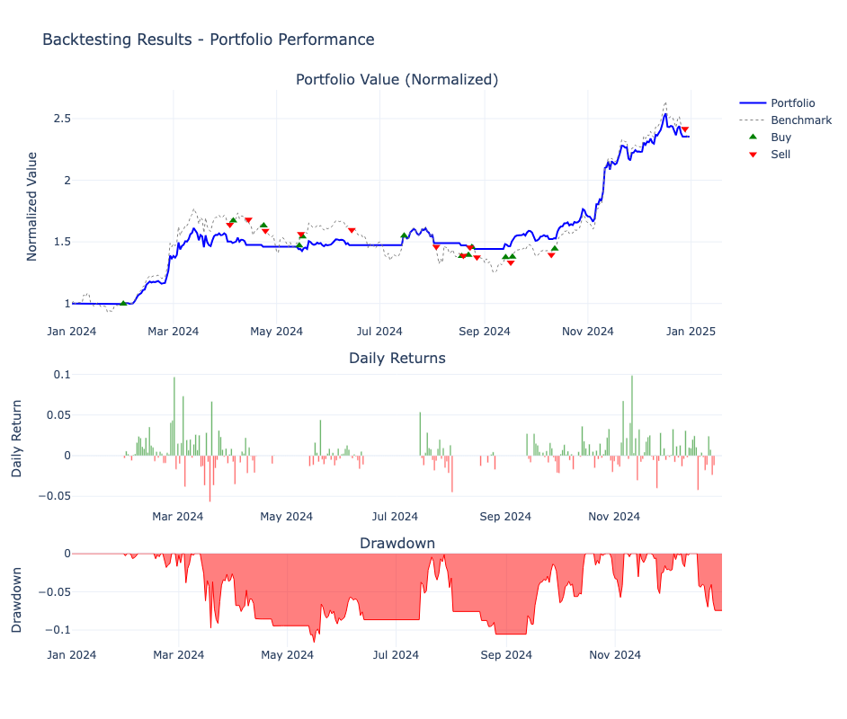
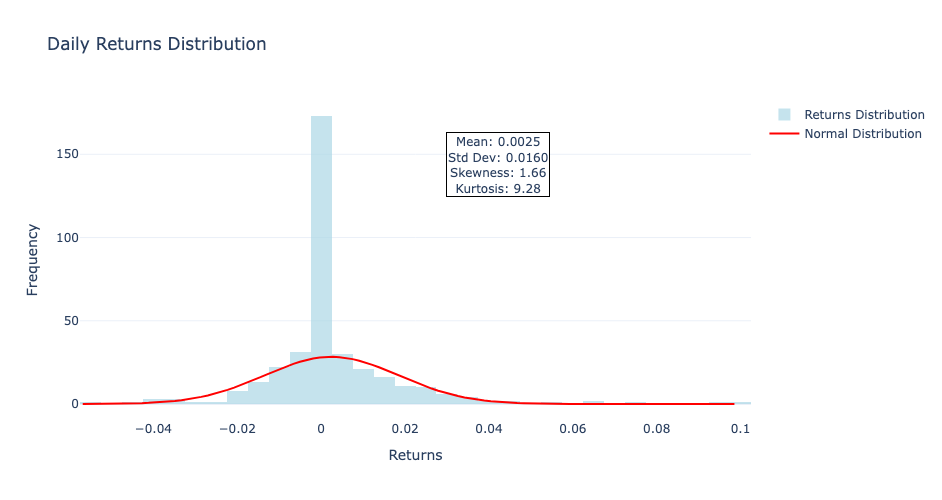
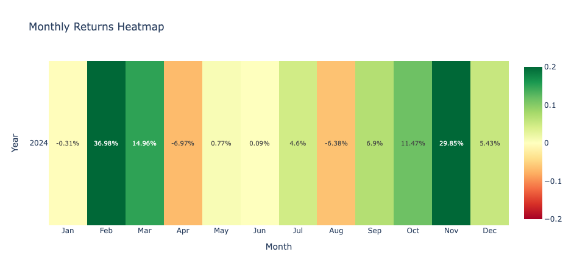

# 📈 간단한 업비트 백테스팅 실전 예제

**⚡ 주피터 노트북으로 실습하기**
> 이 튜토리얼의 모든 코드는 [`quantbt/examples/01_simple_strategy.ipynb`](../examples/01_simple_strategy.ipynb)에서 직접 실행할 수 있습니다.

2024년 1년간 KRW-BTC 일봉 데이터로 **SMA 브레이크아웃 전략** 백테스팅

## 🎯 전략 개요

**간단한 이동평균 기반 전략:**
- **매수**: 현재가가 15일 이동평균선(SMA15) **상회** 시
- **매도**: 현재가가 30일 이동평균선(SMA30) **하회** 시 
- **포지션**: 한 번에 하나만, 자본의 80% 사용

## 💻 실행 코드와 결과

### 1. 필요한 모듈 임포트

```python
# 프로젝트 루트를 Python 경로에 추가
import sys
import os
from pathlib import Path

# 현재 노트북의 위치에서 프로젝트 루트 찾기
current_dir = Path.cwd()
if 'examples' in str(current_dir):
    # examples 폴더에서 실행하는 경우
    project_root = current_dir.parent.parent
else:
    # 프로젝트 루트에서 실행하는 경우
    project_root = current_dir

# 프로젝트 루트를 Python 경로에 추가
if str(project_root) not in sys.path:
    sys.path.insert(0, str(project_root))

# 필요한 모듈 가져오기
from typing import List, Dict, Any, Optional
import polars as pl
from datetime import datetime

from quantbt import (
    SimpleBacktestEngine, 
    SimpleBroker, 
    TradingStrategy, 
    MarketDataBatch, 
    BacktestConfig,
    UpbitDataProvider,
    Order,
    OrderSide,
    OrderType,
)
print("✅ 모든 QuantBT 모듈이 성공적으로 가져와졌습니다!")
```

**실행 결과:**
```
✅ 모든 QuantBT 모듈이 성공적으로 가져와졌습니다!
```

### 2. 전략 클래스 정의

```python
class SimpleSMAStrategy(TradingStrategy):
    """간단한 SMA 브레이크아웃 전략
    
    매수: 가격이 SMA15 상회
    매도: 가격이 SMA30 하회  
    """
    
    def __init__(self, buy_sma: int = 15, sell_sma: int = 30):
        super().__init__(
            name="SimpleSMAStrategy",
            config={
                "buy_sma": buy_sma,
                "sell_sma": sell_sma
            },
            position_size_pct=0.8,  # 80%씩 포지션
            max_positions=1
        )
        self.buy_sma = buy_sma
        self.sell_sma = sell_sma
        self.indicator_columns = [f"sma_{buy_sma}", f"sma_{sell_sma}"]
        
    def _compute_indicators_for_symbol(self, symbol_data):
        """심볼별 이동평균 지표 계산"""
        
        # 시간순 정렬 확인
        data = symbol_data.sort("timestamp")
        
        # 단순 이동평균 계산
        buy_sma = self.calculate_sma(data["close"], self.buy_sma)
        sell_sma = self.calculate_sma(data["close"], self.sell_sma)
        
        # 지표 컬럼 추가
        return data.with_columns([
            buy_sma.alias(f"sma_{self.buy_sma}"),
            sell_sma.alias(f"sma_{self.sell_sma}")
        ])
    
    def generate_signals(self, data: MarketDataBatch) -> List[Order]:
        """신호 생성 - 가격과 이동평균 비교"""
        orders = []
        
        if not self.context:
            return orders
        
        for symbol in data.symbols:
            current_price = self.get_current_price(symbol, data)
            if not current_price:
                continue
            
            # 현재 지표 값 조회
            buy_sma = self.get_indicator_value(symbol, f"sma_{self.buy_sma}", data)
            sell_sma = self.get_indicator_value(symbol, f"sma_{self.sell_sma}", data)
            
            if buy_sma is None or sell_sma is None:
                continue
            
            current_positions = self.get_current_positions()
            
            # 매수 신호: 가격이 SMA15 상회 + 포지션 없음
            if current_price > buy_sma and symbol not in current_positions:
                portfolio_value = self.get_portfolio_value()
                quantity = self.calculate_position_size(symbol, current_price, portfolio_value)
                
                if quantity > 0:
                    order = Order(
                        symbol=symbol,
                        side=OrderSide.BUY,
                        quantity=quantity,
                        order_type=OrderType.MARKET
                    )
                    orders.append(order)
            
            # 매도 신호: 가격이 SMA30 하회 + 포지션 있음
            elif current_price < sell_sma and symbol in current_positions and current_positions[symbol] > 0:
                order = Order(
                    symbol=symbol,
                    side=OrderSide.SELL,
                    quantity=current_positions[symbol],
                    order_type=OrderType.MARKET
                )
                orders.append(order)
        
        return orders
```

### 3. 백테스팅 설정

```python
# 1. 업비트 데이터 프로바이더
upbit_provider = UpbitDataProvider()

# 2. 백테스팅 설정 (2024년 1년)
config = BacktestConfig(
    symbols=["KRW-BTC"],
    start_date=datetime(2024, 1, 1),
    end_date=datetime(2024, 12, 31),
    timeframe="1d",  # 일봉
    initial_cash=10_000_000,  # 1천만원
    commission_rate=0.0,      # 수수료 0% (테스트용)
    slippage_rate=0.0,        # 슬리피지 0% (테스트용)
    save_portfolio_history=True
)

# 3. 간단한 SMA 전략
strategy = SimpleSMAStrategy(
    buy_sma=15,   # 매수: 가격이 15일 이평선 상회
    sell_sma=30   # 매도: 가격이 30일 이평선 하회
)

# 4. 브로커 설정
broker = SimpleBroker(
    initial_cash=config.initial_cash,
    commission_rate=config.commission_rate,
    slippage_rate=config.slippage_rate
)

# 5. 백테스트 엔진
engine = SimpleBacktestEngine()
engine.set_strategy(strategy)
engine.set_data_provider(upbit_provider)
engine.set_broker(broker)
```

### 4. 백테스팅 실행

```python
# 6. 백테스팅 실행
print(f"📅 기간: {config.start_date.date()} ~ {config.end_date.date()}")
print(f"📈 전략: 가격 > SMA{strategy.buy_sma} 매수, 가격 < SMA{strategy.sell_sma} 매도")
print(f"💰 초기 자본: {config.initial_cash:,.0f}원")
print(f"📊 수수료: {config.commission_rate:.1%} | 슬리피지: {config.slippage_rate:.1%}")

result = await engine.run(config)
```

**실행 결과:**
```
📅 기간: 2024-01-01 ~ 2024-12-31
📈 전략: 가격 > SMA15 매수, 가격 < SMA30 매도
💰 초기 자본: 10,000,000원
📊 수수료: 0.0% | 슬리피지: 0.0%
```

### 5. 결과 출력

```python
# 7. 결과 출력
result.print_summary()
```

## 📊 백테스팅 결과

```
============================================================
                 BACKTEST RESULTS SUMMARY
============================================================
Period          : 2024-01-01 ~ 2024-12-31
Initial Capital : $10,000,000
Final Equity    : $23,533,560
Total Return    : 135.34%
Annual Return   : 135.47%
Volatility      : 30.53%
Sharpe Ratio    : 4.44
Calmar Ratio    : 11.67
Sortino Ratio   : 6.49
Max Drawdown    : 11.61%
Total Trades    : 24
Win Rate        : 50.0%
Profit Factor   : 13.39
Execution Time  : 0.30s
============================================================
```

## 🎨 시각화 기능

```python
# 시각화 데이터 확인
print("\n주피터 노트북에서 사용 가능한 시각화 메서드:")
print("1. result.plot_portfolio_performance() - 포트폴리오 성과 차트")
print("2. result.plot_returns_distribution() - 수익률 분포 히스토그램")
print("3. result.plot_monthly_returns_heatmap() - 월별 수익률 히트맵")
print("4. result.show_performance_comparison() - 벤치마크 비교 표")

# 실제 시각화 실행 (주피터 노트북에서)
result.plot_portfolio_performance()
result.plot_returns_distribution(period="daily")
result.plot_monthly_returns_heatmap()
result.show_performance_comparison()
```


### 📊 포트폴리오 성과 차트


### 📈 수익률 분포 히스토그램


### 🔥 월별 수익률 히트맵


### 📊 전략 성과 비교표
<style type="text/css">
#T_cc7f6_row0_col1, #T_cc7f6_row1_col1, #T_cc7f6_row2_col1, #T_cc7f6_row3_col1, #T_cc7f6_row4_col1, #T_cc7f6_row5_col1, #T_cc7f6_row6_col1, #T_cc7f6_row7_col2, #T_cc7f6_row8_col1 {
  background-color: #d4edda;
  color: #155724;
  font-weight: bold;
}
#T_cc7f6_row0_col2, #T_cc7f6_row1_col2, #T_cc7f6_row2_col2, #T_cc7f6_row3_col2, #T_cc7f6_row4_col2, #T_cc7f6_row5_col2, #T_cc7f6_row6_col2, #T_cc7f6_row7_col1, #T_cc7f6_row8_col2 {
  background-color: #f8d7da;
  color: #721c24;
  font-weight: bold;
}
</style>
<table id="T_cc7f6">
  <thead>
    <tr>
      <th class="blank level0" >&nbsp;</th>
      <th id="T_cc7f6_level0_col0" class="col_heading level0 col0" >Metric</th>
      <th id="T_cc7f6_level0_col1" class="col_heading level0 col1" >Strategy</th>
      <th id="T_cc7f6_level0_col2" class="col_heading level0 col2" >Benchmark</th>
    </tr>
  </thead>
  <tbody>
    <tr>
      <th id="T_cc7f6_level0_row0" class="row_heading level0 row0" >0</th>
      <td id="T_cc7f6_row0_col0" class="data row0 col0" >Total Return (%)</td>
      <td id="T_cc7f6_row0_col1" class="data row0 col1" >135.34</td>
      <td id="T_cc7f6_row0_col2" class="data row0 col2" >134.35</td>
    </tr>
    <tr>
      <th id="T_cc7f6_level0_row1" class="row_heading level0 row1" >1</th>
      <td id="T_cc7f6_row1_col0" class="data row1 col0" >Annual Return (%)</td>
      <td id="T_cc7f6_row1_col1" class="data row1 col1" >135.47</td>
      <td id="T_cc7f6_row1_col2" class="data row1 col2" >134.49</td>
    </tr>
    <tr>
      <th id="T_cc7f6_level0_row2" class="row_heading level0 row2" >2</th>
      <td id="T_cc7f6_row2_col0" class="data row2 col0" >Volatility (%)</td>
      <td id="T_cc7f6_row2_col1" class="data row2 col1" >30.53</td>
      <td id="T_cc7f6_row2_col2" class="data row2 col2" >46.49</td>
    </tr>
    <tr>
      <th id="T_cc7f6_level0_row3" class="row_heading level0 row3" >3</th>
      <td id="T_cc7f6_row3_col0" class="data row3 col0" >Sharpe Ratio</td>
      <td id="T_cc7f6_row3_col1" class="data row3 col1" >4.44</td>
      <td id="T_cc7f6_row3_col2" class="data row3 col2" >2.89</td>
    </tr>
    <tr>
      <th id="T_cc7f6_level0_row4" class="row_heading level0 row4" >4</th>
      <td id="T_cc7f6_row4_col0" class="data row4 col0" >Calmar Ratio</td>
      <td id="T_cc7f6_row4_col1" class="data row4 col1" >11.67</td>
      <td id="T_cc7f6_row4_col2" class="data row4 col2" >4.59</td>
    </tr>
    <tr>
      <th id="T_cc7f6_level0_row5" class="row_heading level0 row5" >5</th>
      <td id="T_cc7f6_row5_col0" class="data row5 col0" >Sortino Ratio</td>
      <td id="T_cc7f6_row5_col1" class="data row5 col1" >6.49</td>
      <td id="T_cc7f6_row5_col2" class="data row5 col2" >5.06</td>
    </tr>
    <tr>
      <th id="T_cc7f6_level0_row6" class="row_heading level0 row6" >6</th>
      <td id="T_cc7f6_row6_col0" class="data row6 col0" >Max Drawdown (%)</td>
      <td id="T_cc7f6_row6_col1" class="data row6 col1" >11.61</td>
      <td id="T_cc7f6_row6_col2" class="data row6 col2" >29.28</td>
    </tr>
    <tr>
      <th id="T_cc7f6_level0_row7" class="row_heading level0 row7" >7</th>
      <td id="T_cc7f6_row7_col0" class="data row7 col0" >Beta</td>
      <td id="T_cc7f6_row7_col1" class="data row7 col1" >0.52</td>
      <td id="T_cc7f6_row7_col2" class="data row7 col2" >1.00</td>
    </tr>
    <tr>
      <th id="T_cc7f6_level0_row8" class="row_heading level0 row8" >8</th>
      <td id="T_cc7f6_row8_col0" class="data row8 col0" >Alpha</td>
      <td id="T_cc7f6_row8_col1" class="data row8 col1" >0.66</td>
      <td id="T_cc7f6_row8_col2" class="data row8 col2" >0.00</td>
    </tr>
    <tr>
      <th id="T_cc7f6_level0_row9" class="row_heading level0 row9" >9</th>
      <td id="T_cc7f6_row9_col0" class="data row9 col0" >Total Trades</td>
      <td id="T_cc7f6_row9_col1" class="data row9 col1" >24</td>
      <td id="T_cc7f6_row9_col2" class="data row9 col2" >-</td>
    </tr>
    <tr>
      <th id="T_cc7f6_level0_row10" class="row_heading level0 row10" >10</th>
      <td id="T_cc7f6_row10_col0" class="data row10 col0" >Win Rate (%)</td>
      <td id="T_cc7f6_row10_col1" class="data row10 col1" >50.0</td>
      <td id="T_cc7f6_row10_col2" class="data row10 col2" >-</td>
    </tr>
    <tr>
      <th id="T_cc7f6_level0_row11" class="row_heading level0 row11" >11</th>
      <td id="T_cc7f6_row11_col0" class="data row11 col0" >Profit Factor</td>
      <td id="T_cc7f6_row11_col1" class="data row11 col1" >13.39</td>
      <td id="T_cc7f6_row11_col2" class="data row11 col2" >-</td>
    </tr>
  </tbody>
</table>


## 🚀 더 알아보기

**📓 주피터 노트북으로 실습:**
1. [`quantbt/examples/01_simple_strategy.ipynb`](../examples/01_simple_strategy.ipynb) 파일 열기
2. 셀 단위로 실행하며 학습
3. 파라미터 조정하여 다양한 실험
4. 시각화 차트로 성과 분석

이제 QuantBT 프레임워크로 실제 암호화폐 백테스팅을 시작할 수 있습니다! 