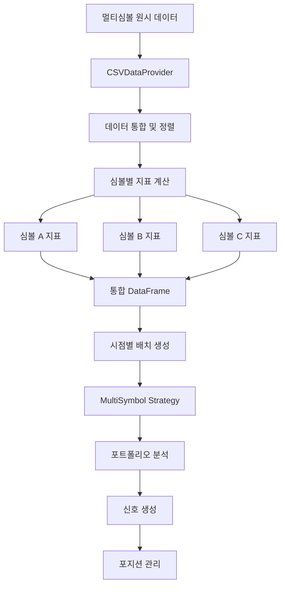
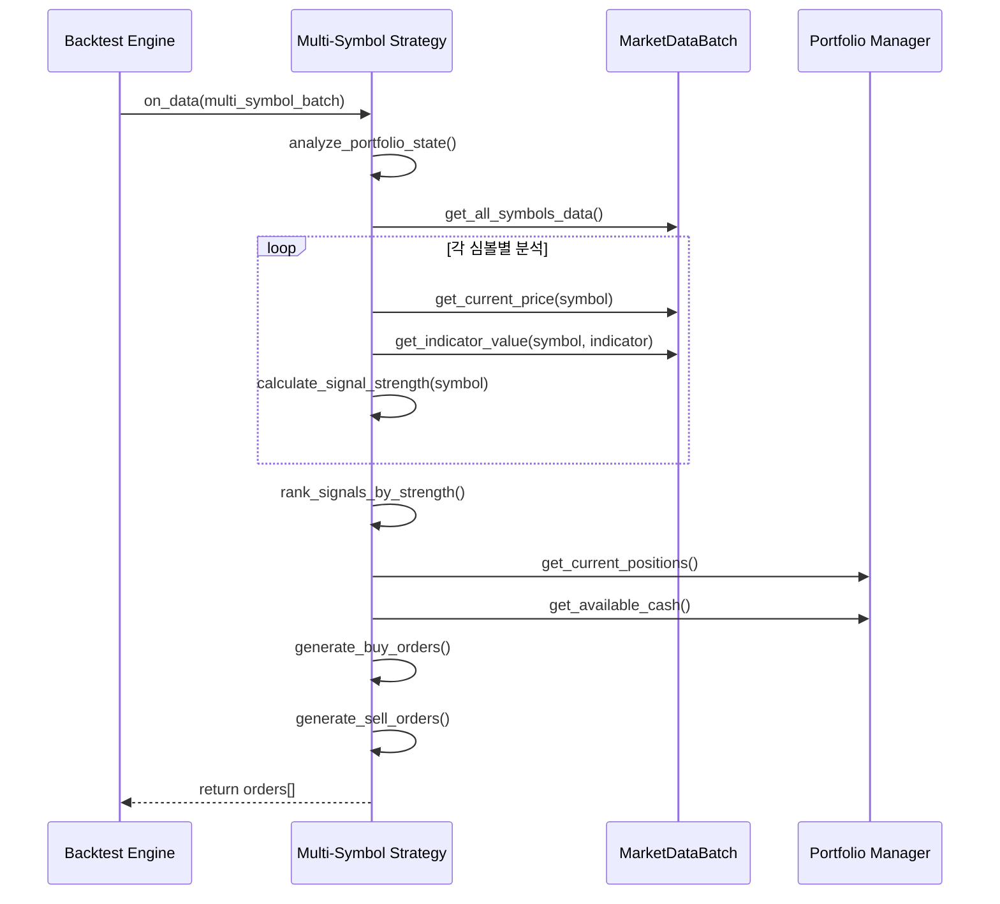

# 멀티심볼 포트폴리오 전략 가이드 📊

QuantBT의 멀티심볼 기능을 사용하여 여러 종목을 동시에 관리하는 포트폴리오 전략을 개발하는 방법을 안내합니다.

## 🎯 개요

멀티심볼 전략을 통해 다음과 같은 고급 기능을 활용할 수 있습니다:

- **포트폴리오 다변화**: 여러 종목에 분산 투자로 리스크 분산
- **크로스 심볼 분석**: 종목 간 상관관계 및 상대 강도 분석
- **동적 포지션 관리**: 전체 포트폴리오 관점에서 최적화된 포지션 관리
- **효율적인 지표 계산**: 모든 심볼의 지표를 한 번에 사전 계산

## 🏗️ 멀티심볼 데이터 처리 아키텍처



## 🔄 멀티심볼 신호 생성 플로우



## 📋 기본 멀티심볼 전략 구조

### 1. 기본 구현 템플릿

```python
from quantbt import TradingStrategy, Order, OrderSide, OrderType
import polars as pl
from typing import List, Dict, Any

class MultiSymbolStrategy(TradingStrategy):
    """멀티심볼 전략 기본 템플릿"""
    
    def __init__(
        self,
        name: str = "MultiSymbolStrategy",
        config: Dict[str, Any] = None,
        position_size_pct: float = 0.2,  # 각 심볼당 20%
        max_positions: int = 5           # 최대 5개 종목
    ):
        super().__init__(
            name=name,
            config=config or {},
            position_size_pct=position_size_pct,
            max_positions=max_positions
        )
        
        # 사용할 지표 컬럼 정의
        self.indicator_columns = ["sma_20", "sma_50", "rsi_14", "volume_ratio"]
    
    def _compute_indicators_for_symbol(self, symbol_data: pl.DataFrame) -> pl.DataFrame:
        """심볼별 지표 사전 계산 - 반드시 구현해야 하는 메서드"""
        data = symbol_data.sort("timestamp")
        
        # 필요한 지표들 계산
        sma_20 = self.calculate_sma(data["close"], 20)
        sma_50 = self.calculate_sma(data["close"], 50)
        rsi_14 = self.calculate_rsi(data["close"], 14)
        
        # 거래량 비율 계산
        volume_avg = self.calculate_sma(data["volume"], 20)
        volume_ratio = data["volume"] / volume_avg
        
        # 지표 컬럼 추가하여 반환
        return data.with_columns([
            sma_20.alias("sma_20"),
            sma_50.alias("sma_50"),
            rsi_14.alias("rsi_14"),
            volume_ratio.alias("volume_ratio")
        ])
    
    def generate_signals(self, data) -> List[Order]:
        """멀티심볼 신호 생성 - 지표값과 단순 비교"""
        orders = []
        
        # 포트폴리오 상태 분석
        portfolio_value = self.get_portfolio_value()
        current_positions = self.get_current_positions()
        available_slots = self.max_positions - len(current_positions)
        
        # 모든 심볼에 대한 신호 강도 계산
        buy_signals = []
        
        for symbol in data.symbols:
            # 현재 가격 및 지표값 조회
            current_price = self.get_current_price(symbol, data)
            sma_20 = self.get_indicator_value(symbol, "sma_20", data)
            sma_50 = self.get_indicator_value(symbol, "sma_50", data)
            rsi = self.get_indicator_value(symbol, "rsi_14", data)
            volume_ratio = self.get_indicator_value(symbol, "volume_ratio", data)
            
            if not all(v is not None for v in [current_price, sma_20, sma_50, rsi, volume_ratio]):
                continue
            
            # 매수 신호 계산
            if symbol not in current_positions:
                signal_strength = self._calculate_buy_signal_strength(
                    current_price, sma_20, sma_50, rsi, volume_ratio
                )
                
                if signal_strength > 0:
                    buy_signals.append((symbol, signal_strength, current_price))
            
            # 매도 신호 확인
            elif symbol in current_positions:
                should_sell = self._should_sell_position(
                    symbol, current_price, sma_20, sma_50, rsi
                )
                
                if should_sell:
                    orders.append(Order(
                        symbol=symbol,
                        side=OrderSide.SELL,
                        quantity=current_positions[symbol],
                        order_type=OrderType.MARKET
                    ))
        
        # 신호 강도 순으로 정렬하여 상위 종목만 매수
        buy_signals.sort(key=lambda x: x[1], reverse=True)
        
        for symbol, strength, price in buy_signals[:available_slots]:
            quantity = self.calculate_position_size(symbol, price, portfolio_value)
            orders.append(Order(
                symbol=symbol,
                side=OrderSide.BUY,
                quantity=quantity,
                order_type=OrderType.MARKET
            ))
        
        return orders
    
    def _calculate_buy_signal_strength(
        self, 
        price: float, 
        sma_20: float, 
        sma_50: float, 
        rsi: float, 
        volume_ratio: float
    ) -> float:
        """매수 신호 강도 계산 (0~1)"""
        strength = 0.0
        
        # 기술적 조건들
        if price > sma_20 > sma_50:  # 상승 트렌드
            strength += 0.4
        
        if rsi < 70:  # 과매수 아님
            strength += 0.3
        
        if volume_ratio > 1.2:  # 거래량 증가
            strength += 0.3
        
        return min(strength, 1.0)
    
    def _should_sell_position(
        self, 
        symbol: str, 
        price: float, 
        sma_20: float, 
        sma_50: float, 
        rsi: float
    ) -> bool:
        """매도 조건 확인"""
        # 트렌드 반전 또는 과매수 상태
        return (price < sma_20 or sma_20 < sma_50 or rsi > 80)
```

## 🎨 실전 멀티심볼 전략 예제

### 1. 상대 강도 로테이션 전략

```python
class RelativeStrengthRotationStrategy(TradingStrategy):
    """상대 강도 기반 종목 로테이션 전략"""
    
    def __init__(self):
        super().__init__(
            name="RelativeStrengthRotation",
            config={
                "lookback_period": 20,      # 상대 강도 계산 기간
                "rebalance_threshold": 0.1, # 리밸런싱 임계값
                "momentum_weight": 0.6,     # 모멘텀 가중치
                "volatility_weight": 0.4    # 변동성 가중치
            },
            position_size_pct=0.25,  # 각 종목당 25%
            max_positions=4          # 최대 4개 종목
        )
        self.indicator_columns = ["returns", "volatility", "momentum_score", "relative_strength"]
    
    def _compute_indicators_for_symbol(self, symbol_data: pl.DataFrame) -> pl.DataFrame:
        data = symbol_data.sort("timestamp")
        lookback = self.config["lookback_period"]
        
        # 수익률 계산
        returns = data["close"].pct_change()
        
        # 변동성 계산 (rolling std)
        volatility = returns.rolling_std(lookback)
        
        # 모멘텀 스코어 (수익률 / 변동성)
        momentum_score = returns.rolling_mean(lookback) / volatility
        
        return data.with_columns([
            returns.alias("returns"),
            volatility.alias("volatility"),
            momentum_score.alias("momentum_score"),
            pl.lit(0.0).alias("relative_strength")  # 나중에 계산
        ])
    
    def generate_signals(self, data) -> List[Order]:
        """상대 강도 기반 신호 생성"""
        orders = []
        current_positions = self.get_current_positions()
        portfolio_value = self.get_portfolio_value()
        
        # 모든 심볼의 상대 강도 계산
        symbol_scores = []
        
        for symbol in data.symbols:
            momentum_score = self.get_indicator_value(symbol, "momentum_score", data)
            volatility = self.get_indicator_value(symbol, "volatility", data)
            current_price = self.get_current_price(symbol, data)
            
            if all(v is not None for v in [momentum_score, volatility, current_price]):
                # 위험 조정 수익률
                risk_adjusted_return = momentum_score / max(volatility, 0.01)
                symbol_scores.append((symbol, risk_adjusted_return, current_price))
        
        # 상대 강도 순으로 정렬
        symbol_scores.sort(key=lambda x: x[1], reverse=True)
        
        # 상위 종목들 선택
        top_symbols = [item[0] for item in symbol_scores[:self.max_positions]]
        
        # 현재 보유하지 않은 상위 종목 매수
        for symbol, score, price in symbol_scores[:self.max_positions]:
            if symbol not in current_positions and score > 0:
                quantity = self.calculate_position_size(symbol, price, portfolio_value)
                orders.append(Order(
                    symbol=symbol,
                    side=OrderSide.BUY,
                    quantity=quantity,
                    order_type=OrderType.MARKET
                ))
        
        # 상위 종목이 아닌 보유 종목 매도
        for symbol in current_positions:
            if symbol not in top_symbols:
                orders.append(Order(
                    symbol=symbol,
                    side=OrderSide.SELL,
                    quantity=current_positions[symbol],
                    order_type=OrderType.MARKET
                ))
        
        return orders
```

## 📊 실행 예제

### 멀티심볼 백테스팅 실행

```python
import asyncio
from quantbt import (
    SimpleBacktestEngine,
    CSVDataProvider,
    SimpleBroker,
    BacktestConfig
)
from datetime import datetime

async def run_multi_symbol_backtest():
    """멀티심볼 백테스팅 실행 예제"""
    
    # 백테스팅 설정
    config = BacktestConfig(
        start_date=datetime(2023, 1, 1),
        end_date=datetime(2023, 12, 31),
        initial_cash=1000000.0,  # 100만원
        symbols=["AAPL", "MSFT", "GOOGL", "AMZN", "TSLA", "NVDA", "META"],  # 7개 종목
        timeframe="1D",
        commission_rate=0.001,   # 0.1% 수수료
        slippage_rate=0.0005     # 0.05% 슬리피지
    )
    
    # 컴포넌트 초기화
    data_provider = CSVDataProvider("./data")
    broker = SimpleBroker(
        initial_cash=config.initial_cash,
        commission_rate=config.commission_rate,
        slippage_rate=config.slippage_rate
    )
    
    # 멀티심볼 전략 선택
    strategy = RelativeStrengthRotationStrategy()
    
    # 백테스팅 엔진 설정
    engine = SimpleBacktestEngine()
    engine.set_strategy(strategy)
    engine.set_data_provider(data_provider)
    engine.set_broker(broker)
    
    print(f"🚀 멀티심볼 백테스팅 시작")
    print(f"   대상 종목: {len(config.symbols)}개")
    print(f"   전략: {strategy.name}")
    print(f"   기간: {config.start_date.date()} ~ {config.end_date.date()}")
    
    # 백테스팅 실행
    result = await engine.run(config)
    
    # 결과 분석
    print("\n📈 백테스팅 결과")
    print("=" * 50)
    result.print_summary()
    
    # 상세 성과 지표
    print(f"\n📊 포트폴리오 성과")
    print(f"   총 수익률: {result.total_return_pct:.2f}%")
    print(f"   연간 수익률: {result.annual_return_pct:.2f}%")
    print(f"   샤프 비율: {result.sharpe_ratio:.2f}")
    print(f"   최대 낙폭: {result.max_drawdown_pct:.2f}%")
    print(f"   승률: {result.win_rate_pct:.2f}%")
    print(f"   총 거래 수: {result.total_trades}")
    
    return result

# 실행
if __name__ == "__main__":
    result = asyncio.run(run_multi_symbol_backtest())
```

## 🧪 테스트 실행

### 1. 기본 테스트

```bash
# 기본 멀티심볼 백테스팅 실행
cd quantbt
python -c "
import asyncio
from examples.simple_strategy import MultiSymbolStrategy
from quantbt import SimpleBacktestEngine, CSVDataProvider, SimpleBroker, BacktestConfig
from datetime import datetime

async def test():
    config = BacktestConfig(
        symbols=['AAPL', 'MSFT', 'GOOGL'],
        start_date=datetime(2023, 1, 1),
        end_date=datetime(2023, 6, 30),
        initial_cash=100000
    )
    
    strategy = MultiSymbolStrategy()
    engine = SimpleBacktestEngine()
    engine.set_strategy(strategy)
    engine.set_data_provider(CSVDataProvider('./data'))
    engine.set_broker(SimpleBroker(initial_cash=100000))
    
    result = await engine.run(config)
    print(f'Multi-symbol result: {result.total_return_pct:.2f}%')

asyncio.run(test())
"
```

### 2. 전략 비교 테스트

```python
async def compare_strategies():
    """단일 심볼 vs 멀티심볼 전략 비교"""
    
    # 단일 심볼 백테스팅
    single_config = BacktestConfig(
        symbols=["AAPL"],  # 단일 종목
        start_date=datetime(2023, 1, 1),
        end_date=datetime(2023, 12, 31),
        initial_cash=100000
    )
    
    # 멀티심볼 백테스팅  
    multi_config = BacktestConfig(
        symbols=["AAPL", "MSFT", "GOOGL", "AMZN", "TSLA"],  # 5개 종목
        start_date=datetime(2023, 1, 1),
        end_date=datetime(2023, 12, 31),
        initial_cash=100000
    )
    
    # 결과 비교
    # ... (구현)
```

## 💡 모범 사례

### 1. 효율적인 지표 계산
```python
# ✅ 좋은 예: 한 번에 여러 지표 계산
def _compute_indicators_for_symbol(self, symbol_data: pl.DataFrame) -> pl.DataFrame:
    data = symbol_data.sort("timestamp")
    
    # Polars의 배치 연산 활용
    indicators = data.select([
        pl.col("close").rolling_mean(20).alias("sma_20"),
        pl.col("close").rolling_mean(50).alias("sma_50"),
        pl.col("close").ewm_mean(span=12).alias("ema_12"),
        (pl.col("volume") / pl.col("volume").rolling_mean(20)).alias("volume_ratio")
    ])
    
    return pl.concat([data, indicators], how="horizontal")
```

### 2. 리스크 관리
```python
# 포트폴리오 리스크 관리
def _validate_portfolio_risk(self, new_orders, current_positions):
    """포트폴리오 리스크 검증"""
    
    # 집중도 리스크 확인
    max_single_position = 0.25  # 단일 종목 최대 25%
    
    # 섹터 집중도 확인
    max_sector_exposure = 0.4   # 단일 섹터 최대 40%
    
    return validated_orders
```

## 📚 관련 예제 파일

- **[기본 전략 예제](../examples/simple_strategy.py)** - 단일/멀티심볼 호환 전략
- **[업비트 예제](../examples/upbit_example.py)** - 암호화폐 멀티심볼 백테스팅

## 🔧 고급 기능

### 1. 동적 포지션 크기 조절

변동성을 기반으로 포지션 크기를 동적으로 조절하는 방법:

```python
def calculate_position_size(self, symbol: str, price: float, portfolio_value: float) -> float:
    """변동성 기반 포지션 크기 계산"""
    
    # 심볼별 변동성 조회
    volatility = self.get_indicator_value(symbol, "volatility", self.current_data)
    
    if volatility is None or volatility <= 0:
        return super().calculate_position_size(symbol, price, portfolio_value)
    
    # 목표 변동성 (2%)
    target_volatility = 0.02
    
    # 변동성 역비례 포지션 크기
    base_size = portfolio_value * self.position_size_pct
    volatility_adjusted_size = base_size * (target_volatility / volatility)
    
    # 최대/최소 제한
    max_position = portfolio_value * 0.3  # 최대 30%
    min_position = portfolio_value * 0.05  # 최소 5%
    
    adjusted_size = max(min_position, min(max_position, volatility_adjusted_size))
    
    return adjusted_size / price
```

### 2. 섹터 기반 다변화

```python
class SectorDiversifiedStrategy(TradingStrategy):
    """섹터 기반 다변화 전략"""
    
    def __init__(self):
        super().__init__(max_positions=12)
        
        # 섹터 분류
        self.sector_mapping = {
            "AAPL": "Technology",
            "MSFT": "Technology", 
            "GOOGL": "Technology",
            "AMZN": "Consumer",
            "TSLA": "Automotive",
            "JPM": "Financial",
            "JNJ": "Healthcare"
        }
        
        self.max_per_sector = 3  # 섹터당 최대 3개 종목
```

## 🚨 주의사항

1. **데이터 품질**: 모든 심볼의 데이터 품질과 기간이 일치하는지 확인
2. **생존자 편향**: 현재 존재하는 종목만으로 과거를 분석하는 편향 주의
3. **거래 비용**: 멀티심볼 전략은 거래 횟수가 많을 수 있으므로 수수료 고려 필수
4. **메모리 사용량**: 종목 수가 많아질수록 메모리 사용량 증가 주의
5. **계산 복잡도**: 지표 계산 시간이 종목 수에 비례하여 증가

---

**📝 참고**: 이 가이드의 모든 예제는 교육 목적입니다. 실제 투자에 사용하기 전에 충분한 백테스팅과 검증을 거치시기 바랍니다. 