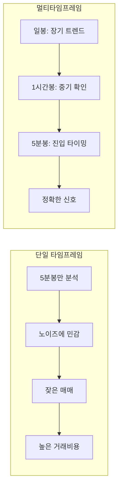
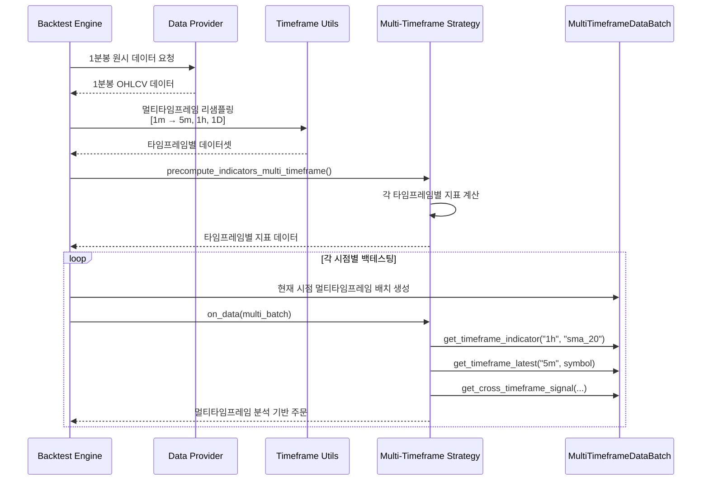

# 멀티타임프레임 백테스팅 가이드 🕐

QuantBT의 **멀티타임프레임 백테스팅 시스템**을 활용하여 여러 시간대를 동시에 분석하는 고급 전략을 구현하는 방법을 알아보겠습니다.

## 📋 목차

- [개념 소개](#개념-소개)
- [시스템 아키텍처](#시스템-아키텍처)
- [기본 사용법](#기본-사용법)
- [고급 전략 예제](#고급-전략-예제)
- [성능 최적화](#성능-최적화)
- [실제 예제 코드](#실제-예제-코드)

## 🎯 개념 소개

### 멀티타임프레임이란?

멀티타임프레임 분석은 **동일한 자산을 여러 시간대에서 동시에 분석**하는 기법입니다. 예를 들어:

- **일봉**: 장기 트렌드 파악
- **1시간봉**: 중기 트렌드 및 지지/저항 확인  
- **5분봉**: 단기 진입/청산 신호 생성

### 왜 멀티타임프레임인가?



**장점:**
- 🎯 **더 정확한 신호**: 여러 시간대 합의로 노이즈 감소
- 📊 **위험 관리**: 장기 트렌드와 반대 매매 방지  
- ⚡ **최적 타이밍**: 장기 방향성 + 단기 진입점
- 💰 **수익률 개선**: 잘못된 신호 필터링으로 성과 향상

## 🏗️ 시스템 아키텍처

### 데이터 처리 흐름



### 지원되는 타임프레임

| 타임프레임 | 설명 | 용도 |
|-----------|------|------|
| `"1m"` | 1분봉 | 기준 데이터, 정밀한 진입/청산 |
| `"5m"` | 5분봉 | 단기 신호 생성 |
| `"15m"` | 15분봉 | 단기-중기 전환점 |
| `"30m"` | 30분봉 | 중기 추세 확인 |
| `"1h"` | 1시간봉 | 중기 트렌드 분석 |
| `"4h"` | 4시간봉 | 중장기 트렌드 |
| `"1d"` | 일봉 | 장기 트렌드, 주요 지지/저항 |

## 🚀 기본 사용법

### 1. 멀티타임프레임 전략 생성

```python
from quantbt import MultiTimeframeTradingStrategy, Order, OrderSide, OrderType
import polars as pl

class SimpleMultiTimeframeStrategy(MultiTimeframeTradingStrategy):
    """간단한 멀티타임프레임 전략 예제"""
    
    def __init__(self):
        super().__init__(
            name="SimpleMultiTimeframe", 
            timeframes=["1m", "5m", "1h"],  # 3개 타임프레임 사용
            primary_timeframe="5m"
        )
    
    def precompute_indicators_multi_timeframe(self, data):
        """각 타임프레임별 지표 계산"""
        result = {}
        
        for timeframe, df in data.items():
            # 타임프레임별 지표 계산
            enriched = df.with_columns([
                # SMA 계산
                pl.col("close").rolling_mean(20).alias("sma_20"),
                pl.col("close").rolling_mean(50).alias("sma_50"),
                # RSI 계산 (간단한 버전)
                self.calculate_rsi(pl.col("close"), 14).alias("rsi")
            ])
            result[timeframe] = enriched
            
        return result
    
    def generate_signals_multi_timeframe(self, multi_data):
        """멀티타임프레임 신호 생성"""
        orders = []
        
        for symbol in multi_data.symbols:
            # 1시간봉에서 장기 트렌드 확인
            hourly_trend = self._analyze_hourly_trend(multi_data, symbol)
            
            # 5분봉에서 진입 신호 확인
            entry_signal = self._check_entry_signal(multi_data, symbol)
            
            # 현재 포지션 확인
            current_positions = self.get_current_positions()
            
            # 매수 조건: 1시간봉 상승 + 5분봉 진입신호
            if (hourly_trend == "bullish" and entry_signal == "buy" 
                and symbol not in current_positions):
                
                # 포지션 크기 계산
                quantity = self.calculate_position_size(
                    symbol, 
                    multi_data.get_timeframe_price("5m", symbol, "close"),
                    self.get_portfolio_value()
                )
                
                orders.append(Order(
                    symbol=symbol,
                    side=OrderSide.BUY,
                    quantity=quantity,
                    order_type=OrderType.MARKET
                ))
                
            # 매도 조건: 트렌드 전환 또는 손절
            elif (symbol in current_positions and 
                  (hourly_trend == "bearish" or entry_signal == "sell")):
                
                orders.append(Order(
                    symbol=symbol,
                    side=OrderSide.SELL,
                    quantity=current_positions[symbol],
                    order_type=OrderType.MARKET
                ))
        
        return orders
    
    def _analyze_hourly_trend(self, multi_data, symbol):
        """1시간봉 트렌드 분석"""
        sma_20 = multi_data.get_timeframe_indicator("1h", "sma_20", symbol)
        sma_50 = multi_data.get_timeframe_indicator("1h", "sma_50", symbol)
        current_price = multi_data.get_timeframe_price("1h", symbol, "close")
        
        if sma_20 and sma_50 and current_price:
            if current_price > sma_20 > sma_50:
                return "bullish"
            elif current_price < sma_20 < sma_50:
                return "bearish"
        
        return "neutral"
    
    def _check_entry_signal(self, multi_data, symbol):
        """5분봉 진입 신호 확인"""
        rsi = multi_data.get_timeframe_indicator("5m", "rsi", symbol)
        sma_20 = multi_data.get_timeframe_indicator("5m", "sma_20", symbol)
        current_price = multi_data.get_timeframe_price("5m", symbol, "close")
        
        if rsi and sma_20 and current_price:
            # RSI 과매도 + 가격이 SMA 위로
            if rsi < 30 and current_price > sma_20:
                return "buy"
            # RSI 과매수 + 가격이 SMA 아래로  
            elif rsi > 70 and current_price < sma_20:
                return "sell"
                
        return "hold"
```

### 2. 백테스팅 실행

```python
import asyncio
from quantbt import SimpleBacktestEngine, CSVDataProvider, SimpleBroker, BacktestConfig
from datetime import datetime

async def run_multi_timeframe_backtest():
    """멀티타임프레임 백테스팅 실행"""
    
    # 데이터 및 브로커 설정
    data_provider = CSVDataProvider("./data")
    broker = SimpleBroker(
        initial_cash=100000,
        commission_rate=0.001,
        slippage_rate=0.0001
    )
    
    # 멀티타임프레임 전략
    strategy = SimpleMultiTimeframeStrategy()
    
    # 백테스팅 설정
    config = BacktestConfig(
        symbols=["BTC", "ETH"],
        start_date=datetime(2024, 1, 1),
        end_date=datetime(2024, 6, 1),
        initial_cash=100000,
        timeframe="1m",  # 기준 타임프레임
        commission_rate=0.001
    )
    
    # 엔진 실행
    engine = SimpleBacktestEngine()
    engine.set_strategy(strategy)
    engine.set_data_provider(data_provider)
    engine.set_broker(broker)
    
    result = await engine.run(config)
    
    # 결과 분석
    print(f"📊 멀티타임프레임 백테스팅 결과:")
    print(f"   • 총 수익률: {result.total_return_pct:.2f}%")
    print(f"   • 샤프 비율: {result.sharpe_ratio:.2f}")
    print(f"   • 최대 낙폭: {result.max_drawdown_pct:.2f}%")
    print(f"   • 총 거래 수: {result.total_trades}")
    
    return result

# 실행
result = asyncio.run(run_multi_timeframe_backtest())
```

## 🎨 고급 전략 예제

### 1. 피라미딩 전략

```python
class PyramidingMultiTimeframeStrategy(MultiTimeframeTradingStrategy):
    """피라미딩 멀티타임프레임 전략"""
    
    def __init__(self):
        super().__init__(
            name="PyramidingMTF",
            timeframes=["1m", "15m", "1h", "4h"],
            max_positions=5  # 최대 5개 포지션
        )
        self.pyramid_levels = 3  # 최대 3단계 피라미딩
    
    def generate_signals_multi_timeframe(self, multi_data):
        orders = []
        
        for symbol in multi_data.symbols:
            # 4시간봉: 주 트렌드
            main_trend = self._get_4h_trend(multi_data, symbol)
            
            # 1시간봉: 중기 확인
            mid_trend = self._get_1h_confirmation(multi_data, symbol)
            
            # 15분봉: 진입 타이밍
            entry_timing = self._get_15m_entry(multi_data, symbol)
            
            # 현재 포지션 레벨 확인
            position_level = self._get_position_level(symbol)
            
            # 피라미딩 조건
            if (main_trend == "strong_bull" and 
                mid_trend == "bull" and 
                entry_timing == "buy" and 
                position_level < self.pyramid_levels):
                
                # 레벨에 따른 포지션 크기 조정
                size_multiplier = 1.0 / (position_level + 1)
                quantity = self.calculate_position_size(
                    symbol, 
                    multi_data.get_timeframe_price("15m", symbol),
                    self.get_portfolio_value()
                ) * size_multiplier
                
                orders.append(Order(
                    symbol=symbol,
                    side=OrderSide.BUY,
                    quantity=quantity,
                    order_type=OrderType.MARKET,
                    metadata={"pyramid_level": position_level + 1}
                ))
        
        return orders
```

### 2. 크로스 타임프레임 멘텀 전략

```python
class MomentumCrossTimeframeStrategy(MultiTimeframeTradingStrategy):
    """크로스 타임프레임 모멘텀 전략"""
    
    def __init__(self):
        super().__init__(
            name="MomentumCTF",
            timeframes=["5m", "30m", "2h", "1d"]
        )
    
    def generate_signals_multi_timeframe(self, multi_data):
        orders = []
        
        for symbol in multi_data.symbols:
            # 각 타임프레임별 모멘텀 점수 계산
            momentum_scores = {}
            
            for tf in self.timeframes:
                momentum_scores[tf] = self._calculate_momentum_score(
                    multi_data, symbol, tf
                )
            
            # 멀티타임프레임 모멘텀 점수 종합
            total_momentum = self._combine_momentum_scores(momentum_scores)
            
            current_positions = self.get_current_positions()
            
            # 강한 상승 모멘텀
            if total_momentum > 0.7 and symbol not in current_positions:
                orders.append(self._create_buy_order(symbol, multi_data))
                
            # 강한 하락 모멘텀 또는 모멘텀 소실
            elif symbol in current_positions and total_momentum < 0.3:
                orders.append(self._create_sell_order(symbol, current_positions))
        
        return orders
    
    def _calculate_momentum_score(self, multi_data, symbol, timeframe):
        """타임프레임별 모멘텀 점수 계산"""
        # RSI, ROC, SMA 기울기 등을 종합한 모멘텀 점수
        rsi = multi_data.get_timeframe_indicator(timeframe, "rsi", symbol)
        current_price = multi_data.get_timeframe_price(timeframe, symbol)
        sma_20 = multi_data.get_timeframe_indicator(timeframe, "sma_20", symbol)
        
        score = 0.0
        
        # RSI 모멘텀 (50 기준)
        if rsi:
            score += (rsi - 50) / 50 * 0.3
            
        # 가격 vs SMA 모멘텀
        if current_price and sma_20:
            price_momentum = (current_price - sma_20) / sma_20
            score += price_momentum * 0.7
            
        return max(-1.0, min(1.0, score))  # -1 ~ 1 범위로 정규화
```

## ⚡ 성능 최적화

### 1. 데이터 캐싱

```python
from functools import lru_cache

class OptimizedMultiTimeframeStrategy(MultiTimeframeTradingStrategy):
    
    @lru_cache(maxsize=1000)
    def _cached_indicator_calculation(self, symbol, timeframe, indicator_type):
        """지표 계산 결과 캐싱"""
        # 자주 사용되는 지표 계산 결과를 캐시
        pass
    
    def precompute_indicators_multi_timeframe(self, data):
        """최적화된 지표 계산"""
        result = {}
        
        for timeframe, df in data.items():
            # 병렬 처리 가능한 지표들을 한 번에 계산
            with_indicators = df.with_columns([
                pl.col("close").rolling_mean(10).alias("sma_10"),
                pl.col("close").rolling_mean(20).alias("sma_20"),
                pl.col("close").rolling_mean(50).alias("sma_50"),
                self.calculate_rsi_vectorized(pl.col("close")).alias("rsi"),
                self.calculate_macd_vectorized(pl.col("close")).alias("macd")
            ])
            result[timeframe] = with_indicators
            
        return result
```

### 2. 메모리 효율성

```python
class MemoryEfficientStrategy(MultiTimeframeTradingStrategy):
    
    def __init__(self):
        super().__init__(
            name="MemoryEfficient",
            timeframes=["5m", "1h"],  # 필요한 타임프레임만 사용
            lookback_periods={"5m": 100, "1h": 50}  # 룩백 기간 제한
        )
    
    def generate_signals_multi_timeframe(self, multi_data):
        """메모리 효율적인 신호 생성"""
        # 최신 N개 데이터만 사용
        limited_data = self._limit_data_size(multi_data)
        
        return self._generate_signals_from_limited_data(limited_data)
```

## 📊 실제 예제 코드

QuantBT 저장소에서 완전한 멀티타임프레임 예제들을 확인할 수 있습니다:

### 🎯 기본 예제
- **[기본 멀티타임프레임 백테스팅](../examples/multi_timeframe_basic_example.py)**
  - 1시간봉 트렌드 + 5분봉 진입신호
  - 간단한 SMA 교차 전략
  - 초보자용 예제

### 🚀 고급 예제  
- **[고급 멀티타임프레임 전략](../examples/multi_timeframe_advanced_example.py)**
  - MACD + RSI + 볼린저밴드 조합
  - 4개 타임프레임 동시 분석
  - 리스크 관리 포함

### 💼 실전 예제
- **[기존 멀티타임프레임 백테스팅 예제](../examples/multi_timeframe_backtest_example.py)**
  - 완전한 멀티타임프레임 시스템 구현
  - 실제 동작하는 예제 코드
  - 성능 분석 포함

## 🔧 문제 해결

### 자주 묻는 질문

**Q: 타임프레임이 많을수록 더 좋은가요?**

A: 아니요. 너무 많은 타임프레임은 오히려 성능을 저하시킬 수 있습니다. 보통 3-4개 타임프레임이 적정합니다.

**Q: 어떤 타임프레임 조합이 좋나요?**

A: 일반적으로 다음 조합들이 효과적입니다:
- **스캘핑**: 1m, 5m, 15m
- **스윙**: 5m, 1h, 4h  
- **포지션**: 1h, 4h, 1d

**Q: 메모리 사용량이 너무 높아요.**

A: 다음을 시도해보세요:
- 룩백 기간 줄이기
- 불필요한 지표 제거
- 타임프레임 수 줄이기

### 성능 튜닝 팁

1. **지표 최적화**: 필요한 지표만 계산
2. **데이터 필터링**: 룩백 기간 제한
3. **캐싱 활용**: 반복 계산 방지
4. **배치 크기 조정**: 메모리와 성능의 균형

## 📈 다음 단계

멀티타임프레임 백테스팅을 마스터했다면:

1. **[멀티심볼 전략](multi_symbol_guide.md)**과 조합
2. **[고급 지표](indicators.md)** 학습
3. **[포트폴리오 최적화](portfolio_optimization.md)** 적용
4. **[실시간 트레이딩](live_trading.md)** 전환

---

**💡 팁**: 멀티타임프레임 전략은 복잡할수록 좋은 것이 아닙니다. 명확한 논리와 간단한 규칙이 더 효과적입니다!

**⚠️ 주의**: 백테스팅에서 좋은 결과가 나왔다고 해서 실제 거래에서도 동일한 성과를 보장하지 않습니다. 충분한 아웃 오브 샘플 테스트를 거치시기 바랍니다. 