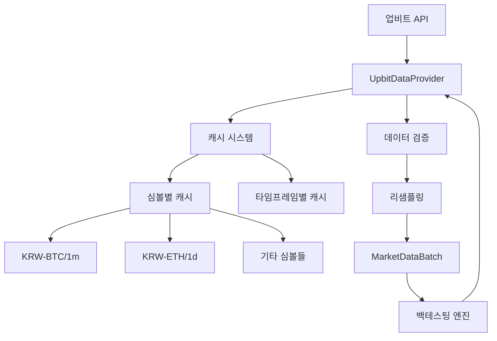
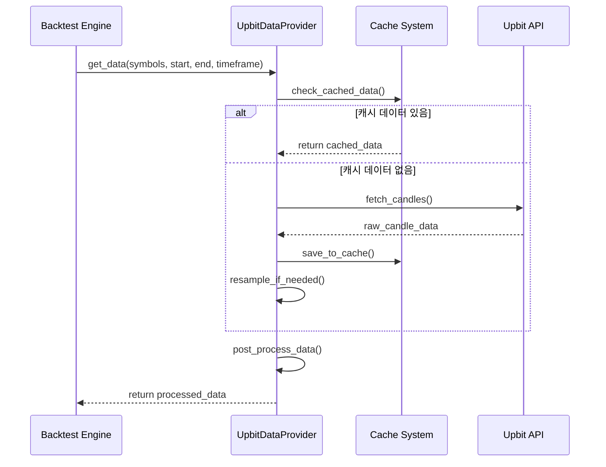

# 업비트 데이터 프로바이더 가이드 🪙

QuantBT의 업비트 데이터 프로바이더를 사용하여 실제 암호화폐 시장 데이터로 백테스팅을 수행하는 방법을 안내합니다.

## 🎯 개요

업비트 데이터 프로바이더는 업비트 API를 통해 실시간 암호화폐 데이터를 수집하고, 효율적인 캐싱 시스템을 통해 빠른 백테스팅 환경을 제공합니다.

### 주요 기능

- **실시간 암호화폐 데이터**: 업비트 API를 통한 실제 시장 데이터 수집
- **지능형 캐싱 시스템**: 계층적 캐시 구조로 API 호출 최소화
- **자동 리샘플링**: 1분봉/일봉 기반으로 모든 타임프레임 지원
- **배치 처리**: 여러 심볼의 효율적인 동시 처리
- **에러 처리**: 네트워크 오류 및 API 제한 자동 대응

## 🏗️ 업비트 데이터 프로바이더 아키텍처



## 🔄 데이터 수집 플로우



## 📋 기본 사용법

### 1. 업비트 프로바이더 초기화

```python
from quantbt.infrastructure.data.upbit_provider import UpbitDataProvider
from datetime import datetime, timedelta

# 기본 설정으로 초기화
upbit_provider = UpbitDataProvider(
    cache_dir="./data/upbit_cache",  # 캐시 저장 경로
    rate_limit_delay=0.1,            # API 호출 간격 (초)
    max_candles_per_request=200      # 한 번에 요청할 최대 캔들 수
)

print("✅ 업비트 데이터 프로바이더 초기화 완료!")
```

### 2. 사용 가능한 심볼 확인

```python
# 거래 가능한 모든 KRW 마켓 심볼 조회
symbols = upbit_provider.get_symbols()

print(f"📈 총 {len(symbols)}개 암호화폐 거래 가능")
print(f"🪙 주요 코인: {symbols[:10]}")

# 특정 코인 확인
major_coins = ["KRW-BTC", "KRW-ETH", "KRW-XRP", "KRW-ADA"]
available_coins = [coin for coin in major_coins if coin in symbols]
print(f"🔍 주요 코인 거래 가능: {available_coins}")
```

### 3. 기본 데이터 조회

```python
import asyncio

async def fetch_crypto_data():
    """기본 암호화폐 데이터 조회"""
    
    # 날짜 범위 설정
    end_date = datetime.now()
    start_date = end_date - timedelta(days=7)  # 최근 7일
    
    async with upbit_provider:
        # 비트코인 1시간봉 데이터 조회
        btc_data = await upbit_provider.get_data(
            symbols=["KRW-BTC"],
            start=start_date,
            end=end_date,
            timeframe="1h"
        )
        
        print(f"📊 조회된 데이터: {btc_data.height}개 캔들")
        
        if btc_data.height > 0:
            latest_price = btc_data.tail(1).select("close").item()
            print(f"💰 최신 가격: {latest_price:,.0f}원")
            
        return btc_data

# 비동기 함수 실행
btc_data = await fetch_crypto_data()
```

## ⚡ 고급 사용법

### 1. 멀티 심볼 데이터 수집

```python
async def fetch_multiple_symbols():
    """여러 암호화폐 데이터 동시 수집"""
    
    symbols = ["KRW-BTC", "KRW-ETH", "KRW-XRP", "KRW-ADA"]
    end_date = datetime.now()
    start_date = end_date - timedelta(days=30)
    
    async with upbit_provider:
        # 여러 심볼의 데이터를 한 번에 수집
        multi_data = await upbit_provider.get_data(
            symbols=symbols,
            start=start_date,
            end=end_date,
            timeframe="4h"  # 4시간봉
        )
        
        print(f"🔢 총 데이터: {multi_data.height}개 캔들")
        
        # 심볼별 데이터 확인
        for symbol in symbols:
            symbol_data = multi_data.filter(pl.col("symbol") == symbol)
            if symbol_data.height > 0:
                latest_price = symbol_data.tail(1).select("close").item()
                coin_name = symbol.replace("KRW-", "")
                print(f"   {coin_name}: {latest_price:,.0f}원 ({symbol_data.height}개 캔들)")

await fetch_multiple_symbols()
```

### 2. 다양한 타임프레임 활용

```python
async def demonstrate_timeframes():
    """지원되는 모든 타임프레임 예제"""
    
    # 지원되는 타임프레임들
    timeframes = ["1m", "5m", "15m", "1h", "4h", "1d"]
    
    async with upbit_provider:
        for tf in timeframes:
            try:
                # 타임프레임별 적절한 기간 설정
                days_back = {"1m": 1, "5m": 3, "15m": 7, "1h": 14, "4h": 30, "1d": 90}.get(tf, 7)
                start_date = datetime.now() - timedelta(days=days_back)
                
                data = await upbit_provider.get_data(
                    symbols=["KRW-BTC"],
                    start=start_date,
                    end=datetime.now(),
                    timeframe=tf
                )
                
                print(f"📊 {tf}: {data.height}개 캔들 (최근 {days_back}일)")
                
            except Exception as e:
                print(f"❌ {tf}: {e}")

await demonstrate_timeframes()
```

### 3. 캐시 시스템 활용

```python
def manage_cache():
    """캐시 시스템 관리"""
    
    # 캐시 정보 확인
    cache_info = upbit_provider.get_cache_info()
    print("=== 기본 캐시 정보 ===")
    print(f"📁 캐시 디렉토리: {cache_info['cache_dir']}")
    print(f"📄 캐시 파일 수: {cache_info['cache_files_count']:,}개")
    print(f"💾 총 캐시 크기: {cache_info['cache_size_mb']:.2f} MB")
    
    # 상세 캐시 정보
    detailed_info = upbit_provider.get_cached_data_info()
    print(f"\n=== 상세 캐시 정보 ===")
    print(f"📊 총 파일 수: {detailed_info['total_files']:,}개")
    print(f"💽 총 크기: {detailed_info['total_size_mb']:.2f} MB")
    
    # 심볼별 캐시 정보
    print(f"\n=== 심볼별 캐시 현황 ===")
    for symbol, timeframes in detailed_info['symbols'].items():
        print(f"\n🪙 {symbol}:")
        for tf, info in timeframes.items():
            print(f"   {tf}: {info['total_candles']:,}개 캔들, {info['total_size_mb']:.2f} MB")
            if info['date_range']['min'] and info['date_range']['max']:
                start_date = info['date_range']['min'].strftime('%Y-%m-%d')
                end_date = info['date_range']['max'].strftime('%Y-%m-%d')
                print(f"       📅 범위: {start_date} ~ {end_date}")

# 캐시 정보 확인
manage_cache()
```

### 4. 데이터 사전 다운로드

```python
async def preload_data():
    """백테스팅을 위한 데이터 사전 다운로드"""
    
    # 주요 암호화폐의 최근 3개월 데이터 사전 다운로드
    symbols = ["KRW-BTC", "KRW-ETH", "KRW-XRP", "KRW-ADA", "KRW-DOT"]
    
    end_date = datetime.now()
    start_date = end_date - timedelta(days=90)  # 3개월
    
    print("📡 데이터 사전 다운로드 시작...")
    
    try:
        result = await upbit_provider.preload_data(
            symbols=symbols,
            start=start_date,
            end=end_date,
            timeframe="1h",  # 1시간봉
            force_download=False  # 기존 캐시 활용
        )
        
        print("✅ 사전 다운로드 완료!")
        for symbol, count in result.items():
            print(f"   {symbol}: {count:,}개 캔들")
            
    except Exception as e:
        print(f"❌ 사전 다운로드 실패: {e}")

await preload_data()
```

## 🔧 백테스팅 엔진과 연동

### 1. 간단한 백테스팅 설정

```python
from quantbt.infrastructure.engine.simple_engine import SimpleBacktestEngine
from quantbt.core.value_objects.backtest_config import BacktestConfig
from quantbt import TradingStrategy, Order, OrderSide, OrderType

class CryptoStrategy(TradingStrategy):
    """간단한 암호화폐 전략"""
    
    def _compute_indicators_for_symbol(self, symbol_data):
        """RSI와 이동평균 계산"""
        data = symbol_data.sort("timestamp")
        
        # 20일 이동평균과 RSI 계산
        sma_20 = self.calculate_sma(data["close"], 20)
        rsi = self.calculate_rsi(data["close"], 14)
        
        return data.with_columns([
            sma_20.alias("sma_20"),
            rsi.alias("rsi")
        ])
    
    def generate_signals(self, data):
        """매수/매도 신호 생성"""
        orders = []
        
        for symbol in data.symbols:
            current_price = self.get_current_price(symbol, data)
            sma_20 = self.get_indicator_value(symbol, "sma_20", data)
            rsi = self.get_indicator_value(symbol, "rsi", data)
            
            if not all(v is not None for v in [current_price, sma_20, rsi]):
                continue
            
            current_positions = self.get_current_positions()
            
            # 매수 조건: 가격이 이평선 위에 있고 RSI가 과매도
            if (current_price > sma_20 and rsi < 30 and 
                symbol not in current_positions):
                
                quantity = self.calculate_position_size(
                    symbol, current_price, self.get_portfolio_value()
                )
                
                orders.append(Order(
                    symbol=symbol,
                    side=OrderSide.BUY,
                    quantity=quantity,
                    order_type=OrderType.MARKET
                ))
            
            # 매도 조건: RSI 과매수 또는 가격이 이평선 아래
            elif (symbol in current_positions and 
                  (rsi > 70 or current_price < sma_20)):
                
                orders.append(Order(
                    symbol=symbol,
                    side=OrderSide.SELL,
                    quantity=current_positions[symbol],
                    order_type=OrderType.MARKET
                ))
        
        return orders

# 백테스팅 실행
async def run_crypto_backtest():
    """암호화폐 백테스팅 실행"""
    
    # 백테스팅 설정
    config = BacktestConfig(
        symbols=["KRW-BTC", "KRW-ETH", "KRW-XRP"],
        start_date=datetime.now() - timedelta(days=30),
        end_date=datetime.now(),
        timeframe="1h",
        initial_cash=10000000  # 1천만원
    )
    
    # 전략과 엔진 설정
    strategy = CryptoStrategy(name="CryptoMomentum")
    engine = SimpleBacktestEngine()
    engine.set_data_provider(upbit_provider)
    
    # 백테스팅 실행
    print("🚀 암호화폐 백테스팅 시작...")
    result = await engine.run(strategy, config)
    
    # 결과 출력
    print(f"✅ 백테스팅 완료!")
    print(f"📊 최종 수익률: {result.total_return:.2%}")
    print(f"💰 최종 자산: {result.final_portfolio_value:,.0f}원")
    print(f"📈 최대 상승률: {result.max_drawup:.2%}")
    print(f"📉 최대 하락률: {result.max_drawdown:.2%}")
    
    return result

# 백테스팅 실행
result = await run_crypto_backtest()
```

### 2. 멀티 타임프레임 전략

```python
class MultiTimeframeCryptoStrategy(TradingStrategy):
    """멀티 타임프레임 암호화폐 전략"""
    
    def __init__(self, name="MultiTF_Crypto", **kwargs):
        super().__init__(name=name, **kwargs)
        self.higher_tf_data = {}  # 상위 시간대 데이터 저장
    
    async def prepare_higher_timeframe_data(self, symbols, start, end):
        """상위 시간대 데이터 사전 준비"""
        print("📊 상위 시간대 데이터 준비 중...")
        
        async with upbit_provider:
            # 4시간봉 데이터 수집 (주 트렌드 확인용)
            higher_data = await upbit_provider.get_data(
                symbols=symbols,
                start=start,
                end=end,
                timeframe="4h"
            )
            
            # 심볼별로 데이터 저장
            for symbol in symbols:
                symbol_data = higher_data.filter(pl.col("symbol") == symbol)
                if symbol_data.height > 0:
                    # 상위 시간대 이동평균 계산
                    sma_50 = self.calculate_sma(symbol_data["close"], 50)
                    self.higher_tf_data[symbol] = symbol_data.with_columns([
                        sma_50.alias("sma_50_4h")
                    ])
    
    def _compute_indicators_for_symbol(self, symbol_data):
        """1시간봉 지표 계산"""
        data = symbol_data.sort("timestamp")
        
        # 단기 지표들
        sma_20 = self.calculate_sma(data["close"], 20)
        rsi = self.calculate_rsi(data["close"], 14)
        macd_line, macd_signal = self.calculate_macd(data["close"])
        
        return data.with_columns([
            sma_20.alias("sma_20"),
            rsi.alias("rsi"),
            macd_line.alias("macd"),
            macd_signal.alias("macd_signal")
        ])
    
    def get_higher_tf_trend(self, symbol, current_time):
        """상위 시간대 트렌드 확인"""
        if symbol not in self.higher_tf_data:
            return "neutral"
        
        higher_data = self.higher_tf_data[symbol]
        
        # 현재 시점의 상위 시간대 데이터 찾기
        recent_data = higher_data.filter(
            pl.col("timestamp") <= current_time
        ).tail(1)
        
        if recent_data.height == 0:
            return "neutral"
        
        current_price = recent_data.select("close").item()
        sma_50_4h = recent_data.select("sma_50_4h").item()
        
        if current_price > sma_50_4h:
            return "bullish"
        elif current_price < sma_50_4h:
            return "bearish"
        else:
            return "neutral"
    
    def generate_signals(self, data):
        """멀티 타임프레임 신호 생성"""
        orders = []
        current_time = data.get_current_timestamp()
        
        for symbol in data.symbols:
            # 현재 가격과 지표값
            current_price = self.get_current_price(symbol, data)
            sma_20 = self.get_indicator_value(symbol, "sma_20", data)
            rsi = self.get_indicator_value(symbol, "rsi", data)
            macd = self.get_indicator_value(symbol, "macd", data)
            macd_signal = self.get_indicator_value(symbol, "macd_signal", data)
            
            if not all(v is not None for v in [current_price, sma_20, rsi, macd, macd_signal]):
                continue
            
            # 상위 시간대 트렌드 확인
            higher_trend = self.get_higher_tf_trend(symbol, current_time)
            current_positions = self.get_current_positions()
            
            # 매수 조건: 상위 시간대 상승 + 단기 매수 신호
            if (higher_trend == "bullish" and 
                current_price > sma_20 and 
                rsi < 40 and 
                macd > macd_signal and
                symbol not in current_positions):
                
                quantity = self.calculate_position_size(
                    symbol, current_price, self.get_portfolio_value()
                )
                
                orders.append(Order(
                    symbol=symbol,
                    side=OrderSide.BUY,
                    quantity=quantity,
                    order_type=OrderType.MARKET
                ))
            
            # 매도 조건: 단기 매도 신호 또는 상위 시간대 하락
            elif (symbol in current_positions and 
                  (rsi > 65 or macd < macd_signal or higher_trend == "bearish")):
                
                orders.append(Order(
                    symbol=symbol,
                    side=OrderSide.SELL,
                    quantity=current_positions[symbol],
                    order_type=OrderType.MARKET
                ))
        
        return orders

# 멀티 타임프레임 백테스팅
async def run_multi_timeframe_backtest():
    """멀티 타임프레임 백테스팅"""
    
    symbols = ["KRW-BTC", "KRW-ETH", "KRW-XRP"]
    end_date = datetime.now()
    start_date = end_date - timedelta(days=60)
    
    # 전략 초기화 및 상위 시간대 데이터 준비
    strategy = MultiTimeframeCryptoStrategy()
    await strategy.prepare_higher_timeframe_data(symbols, start_date, end_date)
    
    # 백테스팅 설정 (1시간봉 기준)
    config = BacktestConfig(
        symbols=symbols,
        start_date=start_date,
        end_date=end_date,
        timeframe="1h",
        initial_cash=10000000
    )
    
    # 백테스팅 실행
    engine = SimpleBacktestEngine()
    engine.set_data_provider(upbit_provider)
    
    result = await engine.run(strategy, config)
    
    print(f"🎯 멀티 타임프레임 전략 결과:")
    print(f"📊 최종 수익률: {result.total_return:.2%}")
    print(f"💰 최종 자산: {result.final_portfolio_value:,.0f}원")
    
    return result

# 멀티 타임프레임 백테스팅 실행
mt_result = await run_multi_timeframe_backtest()
```

## 📊 데이터 분석 및 시각화

### 1. 기본 데이터 분석

```python
import pandas as pd
import matplotlib.pyplot as plt

def analyze_crypto_data(data: pl.DataFrame, symbol: str):
    """암호화폐 데이터 기본 분석"""
    
    # 특정 심볼 데이터 필터링
    symbol_data = data.filter(pl.col("symbol") == symbol)
    
    if symbol_data.height == 0:
        print(f"❌ {symbol} 데이터가 없습니다.")
        return
    
    # pandas로 변환하여 분석
    df = symbol_data.to_pandas()
    
    print(f"📊 {symbol} 데이터 분석")
    print("=" * 50)
    print(f"📅 기간: {df['timestamp'].min()} ~ {df['timestamp'].max()}")
    print(f"📈 최고가: {df['high'].max():,.0f}원")
    print(f"📉 최저가: {df['low'].min():,.0f}원")
    print(f"💰 평균가: {df['close'].mean():,.0f}원")
    print(f"📊 거래량 평균: {df['volume'].mean():,.2f}")
    
    # 수익률 계산
    df['returns'] = df['close'].pct_change()
    daily_volatility = df['returns'].std()
    annualized_volatility = daily_volatility * (365 ** 0.5)  # 연환산 변동성
    
    print(f"📈 일일 변동성: {daily_volatility:.2%}")
    print(f"📊 연환산 변동성: {annualized_volatility:.2%}")
    
    # 최대 상승/하락 분석
    max_gain = df['returns'].max()
    max_loss = df['returns'].min()
    
    print(f"🚀 최대 일일 상승: {max_gain:.2%}")
    print(f"💥 최대 일일 하락: {max_loss:.2%}")

# 데이터 분석 실행
if btc_data.height > 0:
    analyze_crypto_data(btc_data, "KRW-BTC")
```

### 2. 가격 차트 시각화

```python
def plot_crypto_chart(data: pl.DataFrame, symbol: str):
    """암호화폐 가격 차트 생성"""
    
    # 특정 심볼 데이터 필터링
    symbol_data = data.filter(pl.col("symbol") == symbol)
    
    if symbol_data.height == 0:
        print(f"❌ {symbol} 데이터가 없습니다.")
        return
    
    # pandas로 변환
    df = symbol_data.to_pandas()
    df = df.sort_values('timestamp')
    
    # 한글 폰트 설정
    plt.rcParams['font.family'] = 'DejaVu Sans'
    
    # 차트 생성
    fig, (ax1, ax2) = plt.subplots(2, 1, figsize=(12, 8), height_ratios=[3, 1])
    
    # 가격 차트
    ax1.plot(df['timestamp'], df['close'], color='orange', linewidth=2, label='Close Price')
    ax1.fill_between(df['timestamp'], df['low'], df['high'], alpha=0.3, color='lightblue', label='High-Low Range')
    ax1.set_title(f'{symbol} Price Chart', fontsize=14, pad=20)
    ax1.set_ylabel('Price (KRW)', fontsize=12)
    ax1.legend()
    ax1.grid(True, alpha=0.3)
    ax1.yaxis.set_major_formatter(plt.FuncFormatter(lambda x, p: f'{x:,.0f}'))
    
    # 거래량 차트
    ax2.bar(df['timestamp'], df['volume'], color='skyblue', alpha=0.7, label='Volume')
    ax2.set_title('Volume', fontsize=12)
    ax2.set_ylabel('Volume', fontsize=12)
    ax2.set_xlabel('Time', fontsize=12)
    ax2.legend()
    ax2.grid(True, alpha=0.3)
    
    plt.tight_layout()
    plt.show()
    
    print(f"📊 {symbol} 차트 생성 완료!")

# 차트 생성
if btc_data.height > 0:
    plot_crypto_chart(btc_data, "KRW-BTC")
```

## 🛠️ 고급 팁과 최적화

### 1. 효율적인 캐시 관리

```python
def optimize_cache():
    """캐시 최적화 가이드"""
    
    print("🔧 캐시 최적화 팁:")
    print("=" * 40)
    
    # 1. 캐시 용량 확인
    cache_info = upbit_provider.get_cache_info()
    if cache_info['cache_size_mb'] > 1000:  # 1GB 이상
        print("⚠️  캐시 크기가 큽니다. 정리를 고려하세요.")
        
        # 특정 심볼의 오래된 캐시 삭제
        old_symbols = ["KRW-DOGE", "KRW-SHIB"]  # 예시
        for symbol in old_symbols:
            if symbol in upbit_provider.get_symbols():
                print(f"🗑️  {symbol} 캐시 정리 중...")
                upbit_provider.clear_cache(symbol=symbol)
    
    # 2. 캐시 사전 로딩 권장사항
    print("\n📚 사전 로딩 권장사항:")
    print("- 주요 코인: BTC, ETH, XRP (매일 업데이트)")
    print("- 타임프레임: 1h, 4h, 1d (용도별 선택)")
    print("- 기간: 최근 3개월 (백테스팅 충분)")
    
    # 3. 최적 설정
    print("\n⚙️  최적 설정:")
    print("- rate_limit_delay: 0.1초 (API 제한 준수)")
    print("- max_candles_per_request: 200개 (안정성)")
    print("- cache_dir: SSD 드라이브 권장")

optimize_cache()
```

### 2. 에러 처리 및 재시도 로직

```python
import asyncio
from typing import Optional

async def robust_data_fetch(
    symbols: List[str], 
    start: datetime, 
    end: datetime, 
    timeframe: str,
    max_retries: int = 3
) -> Optional[pl.DataFrame]:
    """견고한 데이터 수집 (재시도 로직 포함)"""
    
    for attempt in range(max_retries):
        try:
            async with upbit_provider:
                data = await upbit_provider.get_data(
                    symbols=symbols,
                    start=start,
                    end=end,
                    timeframe=timeframe
                )
                
                if data.height > 0:
                    print(f"✅ 데이터 수집 성공! ({data.height}개 캔들)")
                    return data
                else:
                    print(f"⚠️  빈 데이터 반환 (시도 {attempt + 1}/{max_retries})")
                    
        except aiohttp.ClientError as e:
            print(f"🌐 네트워크 오류 (시도 {attempt + 1}/{max_retries}): {e}")
            if attempt < max_retries - 1:
                await asyncio.sleep(2 ** attempt)  # 지수 백오프
                
        except Exception as e:
            print(f"❌ 기타 오류 (시도 {attempt + 1}/{max_retries}): {e}")
            if attempt < max_retries - 1:
                await asyncio.sleep(1)
    
    print(f"💥 데이터 수집 실패 (최대 시도 횟수 초과)")
    return None

# 견고한 데이터 수집 예제
robust_data = await robust_data_fetch(
    symbols=["KRW-BTC", "KRW-ETH"],
    start=datetime.now() - timedelta(days=7),
    end=datetime.now(),
    timeframe="1h"
)
```

### 3. 성능 모니터링

```python
import time
from contextlib import contextmanager

@contextmanager
def performance_monitor(operation_name: str):
    """성능 모니터링 컨텍스트 매니저"""
    start_time = time.time()
    print(f"🚀 {operation_name} 시작...")
    
    try:
        yield
    finally:
        elapsed_time = time.time() - start_time
        print(f"✅ {operation_name} 완료 ({elapsed_time:.2f}초)")

# 성능 모니터링 예제
async def monitored_data_collection():
    """모니터링이 포함된 데이터 수집"""
    
    with performance_monitor("대용량 데이터 수집"):
        symbols = ["KRW-BTC", "KRW-ETH", "KRW-XRP", "KRW-ADA", "KRW-DOT"]
        
        async with upbit_provider:
            data = await upbit_provider.get_data(
                symbols=symbols,
                start=datetime.now() - timedelta(days=30),
                end=datetime.now(),
                timeframe="1h"
            )
            
            print(f"📊 수집된 데이터: {data.height:,}개 캔들")
            print(f"💾 데이터 크기: {data.estimated_size()} bytes")

await monitored_data_collection()
```

## 🔗 추가 리소스

### 📚 관련 문서
- [멀티심볼 포트폴리오 전략 가이드](multi_symbol_guide.md) - 여러 암호화폐 동시 거래
- [멀티 타임프레임 가이드](multi_timeframe_guide.md) - 복합 시간대 분석
- [업비트 프로바이더 튜토리얼](../examples/upbit_provider_tutorial.ipynb) - 실습 예제

### 🔧 개발 도구
- [디버그 스크립트](../../debug_upbit.py) - 업비트 프로바이더 디버깅
- [프로파일링 도구](../../test_bottleneck_profiling.py) - 성능 최적화

### 🌐 외부 리소스
- [업비트 API 문서](https://docs.upbit.com/reference) - 공식 API 레퍼런스
- [업비트 개발자 센터](https://upbit.com/service_center/open_api_guide) - 개발 가이드

## ❓ 자주 묻는 질문 (FAQ)

### Q1: API 호출 제한은 어떻게 되나요?
**A**: 업비트는 분당 요청 수 제한이 있습니다. `rate_limit_delay=0.1`로 설정하여 안전하게 사용하세요.

### Q2: 캐시된 데이터는 얼마나 유지되나요?
**A**: 캐시된 데이터는 수동으로 삭제하기 전까지 유지됩니다. 디스크 공간을 절약하려면 정기적으로 `clear_cache()`를 사용하세요.

### Q3: 실시간 데이터를 받을 수 있나요?
**A**: 현재는 REST API 기반 히스토리 데이터만 지원합니다. 실시간 데이터는 WebSocket 구현이 필요합니다.

### Q4: 메모리 사용량이 많은데 어떻게 해야 하나요?
**A**: 대용량 데이터 처리 시 `get_data_stream()` 메서드를 사용하여 배치 단위로 처리하세요.

### Q5: 다른 거래소 데이터도 사용할 수 있나요?
**A**: 현재는 업비트만 지원합니다. 다른 거래소는 해당 프로바이더를 별도로 구현해야 합니다.

---

이 가이드가 도움이 되었다면 ⭐를 눌러주세요! 추가 질문이나 개선 사항이 있으면 언제든 문의해주세요.
