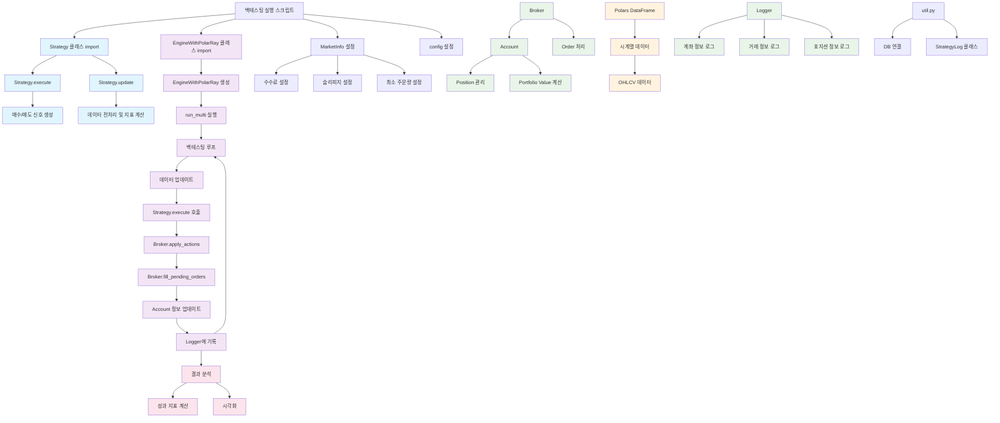
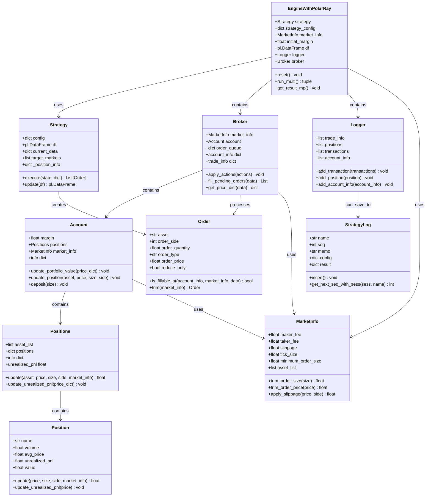
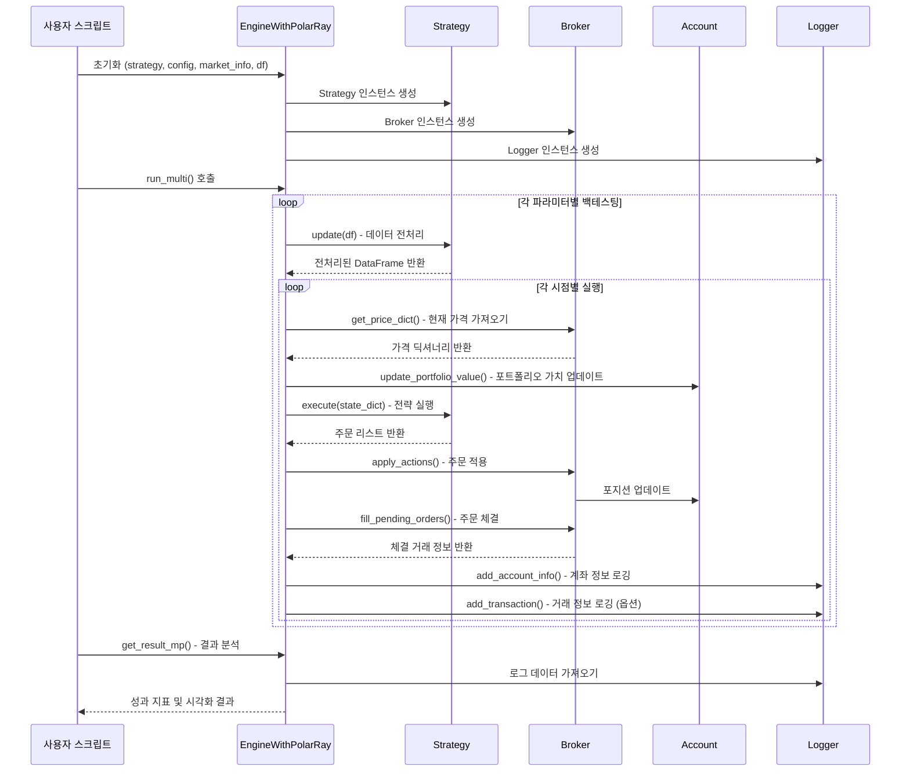

# 백테스팅 엔진 구조 분석

## 개요

이 문서는 Python 기반의 암호화폐/주식 백테스팅 엔진의 전체 구조와 모듈들을 분석한 결과를 정리합니다. 이 백테스팅 엔진은 Polars를 사용한 고성능 데이터 처리와 Ray를 활용한 병렬 처리를 지원합니다.

## 주요 모듈 구성

### 1. 핵심 모듈

| 모듈명 | 파일 경로 | 주요 기능 |
|--------|----------|----------|
| `core.py` | `/backtesting/core.py` | 백테스팅 핵심 클래스들 (Broker, Account, Position, Order 등) |
| `core4pf.py` | `/backtesting/core4pf.py` | Polars + Ray 기반 고성능 엔진 (EngineWithPolarRay) |
| `strategy_03.py` | `/backtesting/upbit/strategy_03.py` | 매매 전략 구현 (롱온리 노이즈 임계 돌파 + 역추세 전략) |
| `util.py` | `/backtesting/util.py` | 데이터베이스 연결 및 로그 관리 유틸리티 |

### 2. 거래소별 디렉토리

```
backtesting/
├── upbit/          # 업비트 관련 전략 및 데이터
├── binance/        # 바이낸스 관련 전략 및 데이터  
├── krx/            # 한국거래소(주식) 관련 전략 및 데이터
└── fp/             # 추가 전략 및 데이터
```

## 클래스 구조

### Strategy 클래스
매매 전략의 핵심 로직을 담당합니다.

```python
class Strategy:
    def __init__(self, config: dict)
    def execute(self, state_dict: Dict[str, Any]) -> List[Any]  # 매매 신호 생성
    def update(self, df: pl.DataFrame) -> pl.DataFrame         # 데이터 전처리 및 지표 계산
```

**주요 기능:**
- 다중 시간대 데이터 집계 및 전처리
- 노이즈 지표, 변동성 지표 계산
- 진입/청산 신호 생성
- 손절매 및 이익실현 로직

### EngineWithPolarRay 클래스
고성능 백테스팅 엔진의 핵심 클래스입니다.

```python
class EngineWithPolarRay:
    def __init__(self, strategy, strategy_config, market_info, initial_margin, df_ref, is_ray=True)
    def run_multi(self, multi_param: str) -> tuple           # 다중 파라미터 백테스팅
    def get_result_mp(self, is_draw=False) -> None          # 결과 분석 및 시각화
    def reset(self) -> None                                 # 엔진 초기화
```

**주요 기능:**
- 다중 파라미터 최적화
- Ray를 활용한 병렬 처리
- Polars 기반 고속 데이터 처리
- 실시간 진행률 표시

### Broker 클래스
주문 처리 및 체결 관리를 담당합니다.

```python
class Broker:
    def __init__(self, market_info: MarketInfo, initial_margin: float)
    def apply_actions(self, actions: List[Dict], price_dict: Dict) -> None
    def fill_pending_orders(self, data: Dict) -> List[Dict]
    def get_price_dict(self, data: Dict) -> Dict[str, float]
```

**주요 기능:**
- 주문 접수 및 검증
- 시장가/지정가 주문 체결
- 슬리피지 및 수수료 적용
- 포지션 관리

### Account 클래스
계좌 및 포트폴리오 관리를 담당합니다.

```python
class Account:
    def __init__(self, margin: float, market_info: MarketInfo)
    def update_portfolio_value(self, price_dict: Dict[str, float]) -> None
    def update_position(self, asset: str, price: float, size: float, side: int) -> None
```

**주요 기능:**
- 현금 및 포지션 관리
- 포트폴리오 가치 계산
- 미실현 손익 계산
- 마진콜 감지

### MarketInfo 클래스
시장 정보 및 거래 조건을 정의합니다.

```python
class MarketInfo:
    def __init__(self, maker_fee, taker_fee, slippage, tick_size, minimum_order_size, asset_list)
```

**주요 속성:**
- `maker_fee`: 메이커 수수료
- `taker_fee`: 테이커 수수료  
- `slippage`: 슬리피지
- `tick_size`: 최소 가격 단위
- `minimum_order_size`: 최소 주문량

## 실행 흐름

### 1. 전체 아키텍처 다이어그램



### 2. 클래스 관계 다이어그램



### 3. 실행 시퀀스 다이어그램



## 사용 예시

### 기본 백테스팅 실행

```python
import polars as pl
from strategy_03 import Strategy
from core4pf import EngineWithPolarRay, MarketInfo

# 시장 정보 설정
market_info = MarketInfo(
    maker_fee=0.00,
    taker_fee=0.00075,
    slippage=0.0005,
    minimum_order_size=0.0000001,
    tick_size=0.0000001,
    asset_list=tickers,
)

# 전략 설정
config = {
    "target_markets": tickers,
    "c_sampling_time_frame": 60,
    "c_sampling_time_num": 5,
    "c_volu_btp_tf": 3,
    "c_volume_tf": 3,
    "c_noise_rank_tf": 2,
    "c_target_volu": 0.008,
    "c_loss_cut_rate": 0.025,
    "c_sell_ma_tf": 2,
    "c_sell_ma": 27,
    "c_offset": [i * 5 for i in range(10)],
}

# 엔진 생성 및 실행
initial_margin = 50000000
engine = EngineWithPolarRay(
    Strategy, config, market_info, initial_margin, df.select(pl.all()), is_ray=False
)

engine.reset()
account_info, trade_info = engine.run_multi(
    use_margin_call=True, multi_param="c_offset", tran_log=False
)

# 결과 분석
engine.get_result_mp(is_draw=True, draw_term="weekly", bm=bm, bm_name="BTC")
```

## 주요 특징

### 1. 고성능 데이터 처리
- **Polars**: Pandas 대비 빠른 데이터 처리
- **Ray**: 병렬 처리를 통한 다중 파라미터 최적화
- **메모리 효율성**: 대용량 데이터 처리 최적화

### 2. 유연한 전략 구현
- **모듈화된 구조**: 전략별 독립적인 구현
- **다양한 지표 지원**: 변동성, 노이즈, 이동평균 등
- **다중 시간대 분석**: 1분~일봉까지 다양한 시간대

### 3. 실전형 백테스팅
- **실제 거래 비용 반영**: 수수료, 슬리피지 적용
- **포지션 관리**: 실시간 포트폴리오 가치 계산
- **리스크 관리**: 손절매, 마진콜 기능

### 4. 결과 분석 및 시각화
- **성과 지표**: 수익률, 샤프비율, MDD 등
- **시각화**: 수익 곡선, 히트맵, 성과 분석 차트
- **벤치마크 비교**: 기준 지수와의 성과 비교

## 확장 가능성

1. **새로운 전략 추가**: Strategy 클래스를 상속하여 새로운 전략 구현
2. **거래소 연동**: 실제 거래소 API와 연동하여 실전 매매 지원
3. **고급 지표**: 기술적 분석 지표 추가 구현
4. **머신러닝 통합**: AI 기반 전략 개발 지원
5. **실시간 모니터링**: 웹 인터페이스를 통한 실시간 성과 모니터링

이 백테스팅 엔진은 암호화폐 및 주식 시장에서의 다양한 전략을 효과적으로 검증할 수 있는 포괄적인 도구입니다. 